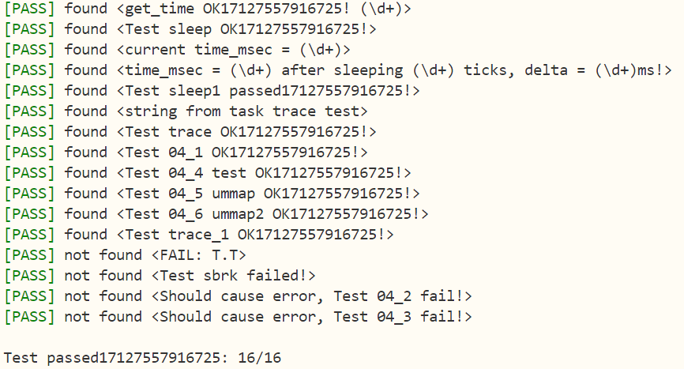

# 编程作业
-------------------------------------------------------------------------
## sys_get_time
-------------------------------------------------------------------------
```
pub fn sys_get_time(_ts: *mut TimeVal, _tz: usize) -> isize {
    trace!("kernel: sys_get_time");
    let us = get_time_us();
    let token = current_user_token();
    let ts = user_ptr_to_kernel_ref(token, _ts );
    *ts = TimeVal {
        sec : us / 1_000_000,
        usec : us % 1_000_000,
    };
    0    
}
```
```
pub fn user_ptr_to_kernel_ref<T>(token: usize, ptr: *mut T) -> &'static mut T {
    //根据 token 创建一个 PageTable 实例，用于操作用户态的页表
    let page_table = PageTable::from_token(token);
    //将用户态指针 ptr 转换为虚拟地址 VirtAddr 类型
    let v = VirtAddr::from(ptr as usize);
    //获取偏移量
    let offset = v.page_offset();
    //将虚拟地址转换为虚拟页号
    let vpn = v.floor();
    //将虚拟页号翻译成对应页表项并返回
    let mut p: PhysAddr = page_table.translate(vpn).unwrap().ppn().into();
    //将页内偏移量 offset 加到物理地址 p 上，得到完整的物理地址
    p.0 += offset;
    //将物理地址 p 转换为对应的内核态可变引用
    p.get_mut()
}
```

-------------------------------------------------------------------------
## sys_trace
-------------------------------------------------------------------------
```
pub fn sys_trace(_trace_request: usize, _id: usize, _data: usize) -> isize {
    trace!("kernel: sys_trace");
    let token = current_user_token();
    match _trace_request {
        0 => {
            if _id > ((1 << 39) - 1) {
                return -1;
            }
            let pte = crate::task::find_pte_by_virtual_address(_id);
            if let Some(pte) = pte {
                if !pte.is_valid() || !pte.readable() {
                    return -1;
                }
            } else {
                return -1;
            }
            let buffers = translated_byte_buffer(token, _id as *const u8, 1);
            buffers[0][0] as isize 
        }
        1 => {
            if _id > ((1 << 39) - 1) {
                return -1;
            }
            let pte = crate::task::find_pte_by_virtual_address(_id);
            if let Some(pte) = pte {
                if !pte.is_valid() || !pte.writable() {
                    return -1;
                }
            } else {
                return -1;
            }
            let mut buffers = translated_byte_buffer(token, _id as *mut u8, 1);
            buffers[0][0] = (_data & 0xff) as u8;
            0
        }
        2 => {
            if _id >= MAX_SYSCALL_NUM {
                return -1;  
            }
            crate::task::get_syscall_count(_id) as isize
        }
        _ => {
            -1
        }
    }
}
```

0：读取用户内存

检查目标地址 _id 是否超出 ​​sv39 虚拟地址范围​​(<=2^39-1)
```
 if _id > ((1 << 39) - 1) {
                return -1;
            }
```

通过页表项（PTE）检查地址是否已映射且​​可读​​，若无效则返回错误
```
let pte = crate::task::find_pte_by_virtual_address(_id);
if let Some(pte) = pte {
    if !pte.is_valid() || !pte.writable() {
        return -1;
    }
}  
else {
    return -1;
 }           
```
目的是检查用户空间某个地址的可读性并返回其值，而非读取连续内存

因此使用 translated_byte_buffer 将用户地址转换为内核安全访问的缓冲区，并返回首个字节的值,是为了安全性

安全性​​：单字节操作能最小化内核与用户空间的数据交互，降低越界访问风险（例如避免意外读取相邻敏感数据）

仅需验证和转换目标地址的一字节，减少页表查询和内存拷贝开销

translated_byte_buffer 的结构​​：
该函数（假设为 rCore 的实现）会将用户空间的 ​​不连续内存区间​​ 转换为内核可安全访问的 ​​缓冲区数组​​，其返回值通常为 Vec<&mut [u8]> 或类似结构。

​​第一维 [0]​​：表示用户地址可能跨多个物理页，这里取第一个物理页的缓冲区。

​​第二维 [0]​​：表示目标地址在该物理页缓冲区中的偏移量。


```
 let buffers = translated_byte_buffer(token, _id as *const u8, 1);
            buffers[0][0] as isize     
```
1：写入用户内存

同理，写入只有这个区别
```
 buffers[0][0] = (_data & 0xff) as u8
```

2：​​查询系统调用次数​​
```
crate::task::get_syscall_count(_id) as isize
```

***有个关键点是***:
计数时，不同的syscall都会increase，那么需要在syscall类里加入这个函数
//syscall/mod.rs
```
pub fn syscall(syscall_id: usize, args: [usize; 3]) -> isize {
    crate::task::increase_sys_call(syscall_id);
    match syscall_id {
        SYSCALL_WRITE => sys_write(args[0], args[1] as *const u8, args[2]),
        SYSCALL_EXIT => sys_exit(args[0] as i32),
        SYSCALL_YIELD => sys_yield(),
        SYSCALL_GET_TIME => sys_get_time(args[0] as *mut TimeVal, args[1]),
        SYSCALL_TRACE => sys_trace(args[0], args[1], args[2]),
        SYSCALL_MMAP => sys_mmap(args[0], args[1], args[2]),
        SYSCALL_MUNMAP => sys_munmap(args[0], args[1]),
        SYSCALL_SBRK => sys_sbrk(args[0] as i32),
        _ => panic!("Unsupported syscall_id: {}", syscall_id),
    }
}
```

-------------------------------------------------------------------------
## find_pte_by_virtual_address
-------------------------------------------------------------------------
//task/mod.rs
```
/// Find PageTableEntry by VirtPageNum, create a frame for a 4KB page table if not exist
pub fn find_pte_by_virtual_address(virtual_address: usize) ->  Option<PageTableEntry> {
    TASK_MANAGER.find_pte_by_virtual_address(virtual_address)
}
```
在impl TaskManager方法中给出vaddr->pte的映射函数
```
/// Virtualaddr->pte
fn find_pte_by_virtual_address(&self, virtual_address: usize) -> Option<PageTableEntry> {
        let inner = self.inner.exclusive_access();
        let current = inner.current_task;
        let va = VirtAddr::from(virtual_address);
        let vpn = va.floor();
        let pte = inner.tasks[current].memory_set.find_pte(vpn);
        if let Some(x) = pte {
            return Some(x.clone());
        }
        else {
            return None;
        }
}

/// VirtPageNum->pte
fn find_pte(&self, vpn: VirtPageNum) -> Option<PageTableEntry> {
    let inner = self.inner.exclusive_access();
    let current = inner.current_task;
    let pte = inner.tasks[current].memory_set.find_pte(vpn);
    if let Some(x) = pte {
        return Some(x.clone());
    }
    else {
        return None;
    }
}    
```


-------------------------------------------------------------------------
详细介绍函数：
```
let inner = self.inner.exclusive_access();// 类似于锁，独占访问权防止并发修改
let current = inner.current_task;// 获取当前正在运行的进程/任务的 ID
```
将原始地址 usize 转换为类型化的虚拟地址 VirtAddr

计算虚拟地址对应的​虚拟页号​​，即去掉页内偏移（VPN = address / PAGE_SIZE）
```
let va = VirtAddr::from(virtual_address);
let vpn = va.floor();
```
由于

exclusive_access() 函数通常用于多线程环境（如 UPSafeCell），返回的 inner 是一个 ​​受保护的临时可变访问​​
若返回内部数据的引用，会破坏 Rust 的借用规则：​​多个线程可能同时持有 PTE 引用，而 inner 的锁已被释放​​，导致数据竞争

因此

查找页表项find_pte,最后返回的是克隆的pte ; 代码在保证安全性的同时，避免了复杂的生命周期管理和锁竞争问题

-------------------------------------------------------------------------
## find_pte
-------------------------------------------------------------------------
在内存管理中被包装

//mm/memory_set.rs

impl MemorySet
```
/// Finds the page table entry corresponding to the given virtual page number.
pub fn find_pte(&self, vpn: VirtPageNum) -> Option<&mut PageTableEntry> {
    self.page_table.find_pte(vpn)    
}
```
页表page_table.rs中有他的实现:(详细可以深入理解)
```
  /// Find PageTableEntry by VirtPageNum
    pub fn find_pte(&self, vpn: VirtPageNum) -> Option<&mut PageTableEntry> {
        let idxs = vpn.indexes();
        let mut ppn = self.root_ppn;
        let mut result: Option<&mut PageTableEntry> = None;
        for (i, idx) in idxs.iter().enumerate() {
            let pte = &mut ppn.get_pte_array()[*idx];
            if i == 2 {
                result = Some(pte);
                break;
            }
            if !pte.is_valid() {
                return None;
            }
            ppn = pte.ppn();
        }
        result
    }  
```

-------------------------------------------------------------------------
## mmap
-------------------------------------------------------------------------
先验证port：只能地三位且有值
```
pub fn sys_mmap(_start: usize, _len: usize, _port: usize) -> isize {
    if _len == 0 {
        return 0;
    }
    //port只能是0x1,0x3,0x5,0x7
    // 0x1: read
    // 0x3: read and write
    // 0x5: read and execute
    // 0x7: read, write and execute
    if _port & !0x7 != 0 || _port & 0x7 == 0 {
        return -1;
    }
    trace!("kernel: sys_mmap NOT IMPLEMENTED YET!");
    to_mmap(_start, _len, _port)
}
```
//task/mod.rs
```
/// select_cur_task_to_mmap
pub fn to_mmap(start: usize, len: usize, port: usize) -> isize {
    TASK_MANAGER.mmap(start, len, port)
}
```
在任务管理方法中：
```
fn mmap(&self, start: usize, len: usize, port: usize) -> isize {
        let mut inner = self.inner.exclusive_access();
        let current_task = inner.current_task;
        inner.tasks[current_task].memory_set.mmap(start, len, port)
    }
```
在内存管理中：
```
/// mmap
    pub fn mmap(&mut self, start: usize, len: usize, port: usize) -> isize {
        let va_start: VirtAddr = start.into(); // 接收start虚拟地址
        if !va_start.aligned() {
            debug!("unmap fail don't aligned");
            return -1;
        }// start虚拟地址必须是4k对齐，检验4k对齐
        if start + len > MEMORY_END {
            debug!("unmap fail out of memory");
            return -1;
        }// 检验是否越界
        let mut va_start: VirtPageNum = va_start.into();// 将虚拟地址转成虚拟页号
        let mut flags = PTEFlags::empty();
        if port & 0b0000_0001 != 0 {
            flags |= PTEFlags::R;
        }

        if port & 0b0000_0010 != 0 {
            flags |= PTEFlags::W;
        }

        if port & 0b0000_0100 != 0 {
            flags |= PTEFlags::X;
        }
        flags |= PTEFlags::U;
        flags |= PTEFlags::V;
        // 取标志位
        if flags.is_empty() {
            debug!("unmap fail no permission");
            return -1;
        }

        let va_end: VirtAddr = (start + len).into();// 找到结束虚拟地址
        let va_end: VirtPageNum = va_end.ceil();// 向上取整，找到结束虚拟页号
        if va_start >= va_end {
            debug!("unmap fail start >= end");
            return -1;
        }

        while va_start != va_end {
            if let Some(pte) = self.page_table.translate(va_start) {// 生成页表项
                if pte.is_valid() {
                    return -1;// 如果已经映射了，返回-1
                }
            }
            if let Some(ppn) = frame_alloc() {
                self.page_table.map(va_start, ppn.ppn, flags);
                self.map_tree.insert(va_start, ppn);
            } else {
                return -1;
            }
            va_start.step();
        }
        0
    }

```
-------------------------------------------------------------------------
## unmmap
-------------------------------------------------------------------------
```
pub fn sys_munmap(_start: usize, _len: usize) -> isize {
    trace!("kernel: sys_munmap NOT IMPLEMENTED YET!");
    to_munmap(_start, _len)
}
```
```
/// select_cur_task_to_mmap
pub fn to_munmap(start: usize, len: usize) -> isize {
    TASK_MANAGER.munmap(start, len)
}
```
```
fn munmap(&self, start: usize, len: usize) -> isize {
        let mut inner = self.inner.exclusive_access();
        let current_task = inner.current_task;
        inner.tasks[current_task].memory_set.unmmap(start, len)
    }
```
```
/// munmap
    pub fn unmmap(&mut self, start: usize, len: usize) -> isize {
        let va_start: VirtAddr = start.into();
        if !va_start.aligned() {
            debug!("unmap fail don't aligned");
            return -1;
        }// 检查4k对齐
        let mut va_start: VirtPageNum = va_start.into();// 虚拟地址转成虚拟页号

        let va_end: VirtAddr = (start + len).into();// 找到结束虚拟地址
        let va_end: VirtPageNum = va_end.ceil();// 向上取整，找到结束虚拟页号

        while va_start != va_end {
            if let Some(unpte) = self.page_table.translate(va_start) {
                if !unpte.is_valid() {
                    debug!("unmap on no map vpn");
                    return -1;
                }// 没有映射，则不需要unmap
            } else {
                return -1;
            }
            self.page_table.unmap(va_start);
            self.map_tree.remove(&va_start);
            va_start.step();
        }
        0
    }
```
-------------------------------------------------------------------------
cd ci-user && make test CHAPTER=4

16/16

-------------------------------------------------------------------------
# 问答作业
-------------------------------------------------------------------------
## 请列举 SV39 页表页表项的组成，描述其中的标志位有何作用？
-------------------------------------------------------------------------
SV39 页表项组成及标志位作用

SV39 页表项（PTE）包含以下字段：
```
​​物理页号（PPN）​​：44 位，表示物理页的基址。
​​标志位​​：共 10 位，包括：
​​V（有效位）​​：表示该 PTE 是否有效。
​​R（可读）​​、​​W（可写）​​、​​X（可执行）​​：权限控制。
​​U（用户位）​​：用户态是否可访问。
​​A（访问位）​​：记录该页是否被访问过。
​​D（修改位）​​：记录该页是否被修改过。
​​RSW（保留位）​​：供操作系统自定义使用。
```
-------------------------------------------------------------------------
## 请问哪些异常可能是缺页导致的？发生缺页时，描述相关重要寄存器的值，上次实验描述过的可以简略

缺页指的是进程访问页面时页面不在页表中或在页表中无效的现象，此时 MMU 将会返回一个中断， 告知 os 进程内存访问出了问题。os 选择填补页表并重新执行异常指令或者杀死进程。

-------------------------------------------------------------------------
```
缺页导致的异常
可能触发缺页的异常包括：
​​指令缺页​​（异常码 12）：取指令时目标页无效。
​​加载缺页​​（异常码 13）：读数据时目标页无效。
​​存储缺页​​（异常码 15）：写数据时目标页无效。
```
```
缺页时的寄存器状态
​​stval​​：保存触发缺页的虚拟地址。
​​scause​​：记录异常原因（如 12、13、15）。
```
-------------------------------------------------------------------------
## 以下做法这样做有哪些好处(Lazy策略)

缺页有两个常见的原因，其一是 Lazy 策略，也就是直到内存页面被访问才实际进行页表操作。 比如，一个程序被执行时，进程的代码段理论上需要从磁盘加载到内存。但是 os 并不会马上这样做， 而是会保存 .text 段在磁盘的位置信息，在这些代码第一次被执行时才完成从磁盘的加载操作

-------------------------------------------------------------------------
```
Lazy 策略的优势
​​减少初始开销​​：避免立即分配未使用的内存。
​​节省资源​​：仅加载实际访问的页面，减少磁盘和内存操作。
```
其实，我们的 mmap 也可以采取 Lazy 策略，比如：一个用户进程先后申请了 10G 的内存空间， 然后用了其中 1M 就直接退出了。按照现在的做法，我们显然亏大了，进行了很多没有意义的页表操作

-------------------------------------------------------------------------
## 处理 10G 连续的内存页面，对应的 SV39 页表大致占用多少内存 (估算数量级即可)？
-------------------------------------------------------------------------
SV39 页表占用估算
10G 内存需映射 10 * 2^30 / 4K = 2.5M 页，每页对应 8 字节 PTE，总大小约 2.5M * 8B = 20MB。三级页表额外开销约 8KB，总量级为 ​​几十 MB​​。

-------------------------------------------------------------------------
## 请简单思考如何才能实现 Lazy 策略，缺页时又如何处理？描述合理即可，不需要考虑实现。
-------------------------------------------------------------------------
```
Lazy 策略实现
​​延迟分配​​：初始标记 PTE 为无效，记录需求信息（如大小）。
​​缺页处理​​：分配物理页，更新 PTE 为有效并设置权限，重新执行指令。
```
缺页的另一个常见原因是 swap 策略，也就是内存页面可能被换到磁盘上了，导致对应页面失效

-------------------------------------------------------------------------
## 此时页面失效如何表现在页表项(PTE)上?
-------------------------------------------------------------------------
```
Swap 策略的 PTE 表现
PTE 的 ​​V 位清零​​，部分字段（如物理页号）可能记录磁盘位置（如交换区偏移）。
```
-------------------------------------------------------------------------
## 双页表与单页表
为了防范侧信道攻击，我们的 os 使用了双页表。但是传统的设计一直是单页表的，也就是说， 用户线程和对应的内核线程共用同一张页表，只不过内核对应的地址只允许在内核态访问。 (备注：这里的单/双的说法仅为自创的通俗说法，并无这个名词概念，详情见 KPTI )

-------------------------------------------------------------------------
```
单页表与双页表
​​单页表更换方式​​：通过修改 satp 寄存器切换进程页表。
​​用户态访问控制​​：内核页面的 PTE 中 ​​U 位为 0​​，用户态访问触发异常。
​​单页表优势​​：
​​上下文切换开销低​​：无需频繁切换页表。
​​TLB 效率高​​：内核与用户共享页表，减少刷新。
​​双页表切换时机​​：用户态/内核态切换时更换页表；单页表仅在进程切换时更换。
```
-------------------------------------------------------------------------
# 荣誉准则
-------------------------------------------------------------------------
1. 在完成本次实验的过程（含此前学习的过程）中，我曾分别与 以下各位 就（与本次实验相关的）以下方面做过交流，还在代码中对应的位置以注释形式记录了具体的交流对象及内容：

《你交流的对象说明》

2. 此外，我也参考了 以下资料 ，还在代码中对应的位置以注释形式记录了具体的参考来源及内容：

《你参考的资料说明》

3. 我独立完成了本次实验除以上方面之外的所有工作，包括代码与文档。 我清楚地知道，从以上方面获得的信息在一定程度上降低了实验难度，可能会影响起评分。

4. 我从未使用过他人的代码，不管是原封不动地复制，还是经过了某些等价转换。 我未曾也不会向他人（含此后各届同学）复制或公开我的实验代码，我有义务妥善保管好它们。 我提交至本实验的评测系统的代码，均无意于破坏或妨碍任何计算机系统的正常运转。 我清楚地知道，以上情况均为本课程纪律所禁止，若违反，对应的实验成绩将按“-100”分计。


-------------------------------------------------------------------------