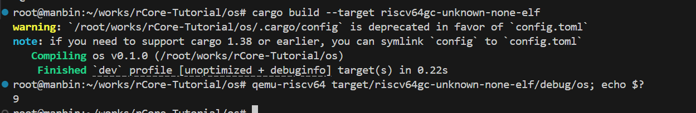
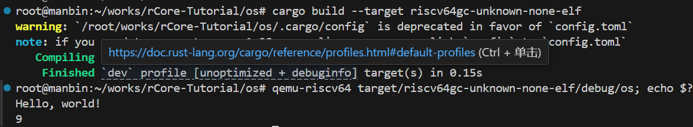
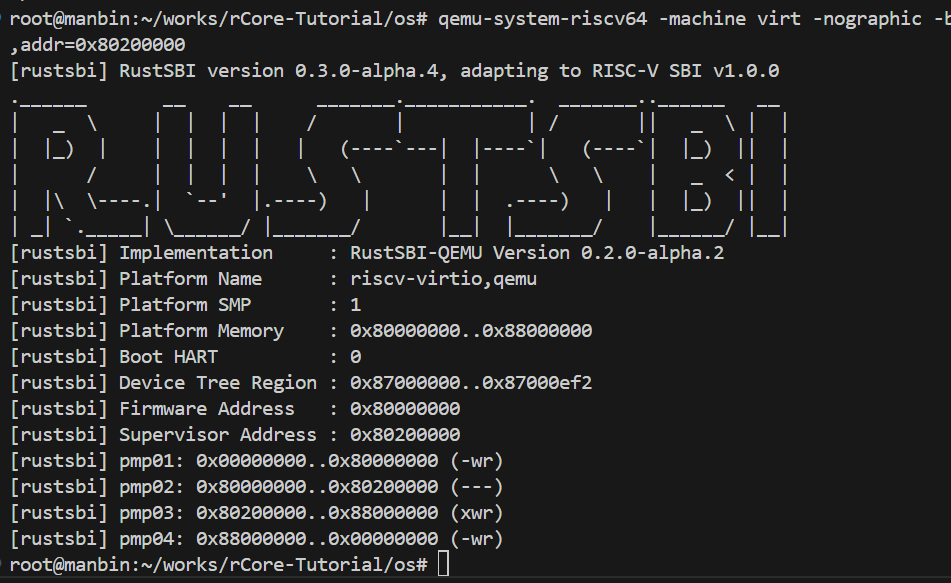
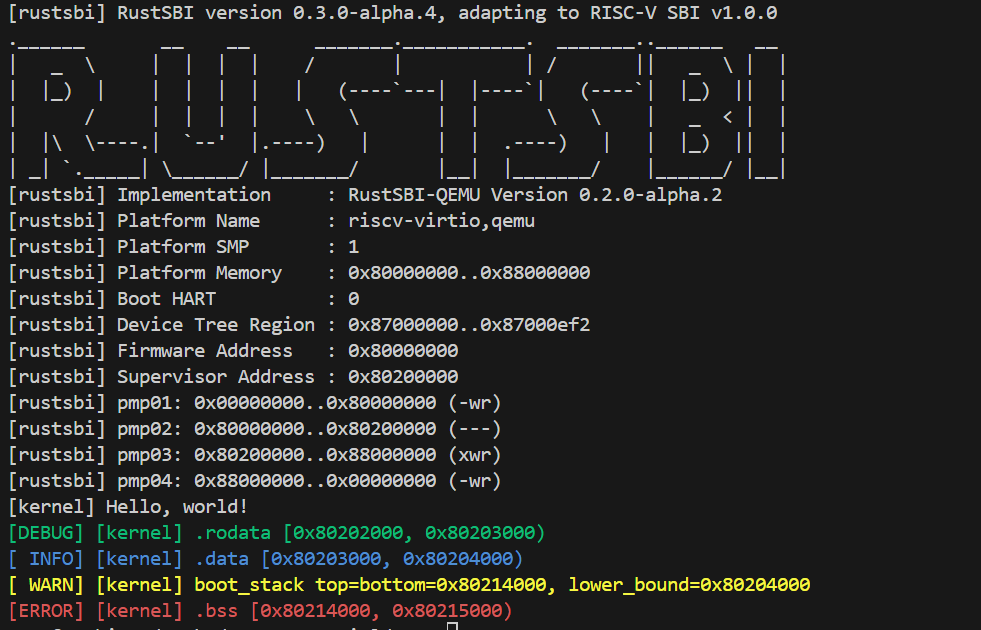

----------------------------------------------------------------
# 回顾：
----------------------------------------------------------------
$ cargo new os

// os/.cargo/config

[build]
target = "riscv64gc-unknown-none-elf"

// os/src/lang_items.rs

use core::panic::PanicInfo;

#[panic_handler]
fn panic(_info: &PanicInfo) -> ! {
    loop {}
}

// os/src/main.rs
#![no_std]
#![no_main]

mod lang_items;

---------------------------------------------------------------
// os/src/main.rs

const SYSCALL_EXIT: usize = 93;

fn syscall(id: usize, args: [usize; 3]) -> isize {
    let mut ret;
    unsafe {
        core::arch::asm!(
            "ecall",
            inlateout("x10") args[0] => ret,
            in("x11") args[1],
            in("x12") args[2],
            in("x17") id,
        );
    }
    ret
}

pub fn sys_exit(xstate: i32) -> isize {
    syscall(SYSCALL_EXIT, [xstate as usize, 0, 0])
}

#[unsafe(no_mangle)]
extern "C" fn _start() {
    sys_exit(9);
}
-------------------------------------------------------------------
//添加了读和退出操作(后续会详细讲解，现在只需要知道调用了sys_exit等函数)
$ cargo build --target riscv64gc-unknown-none-elf
$ qemu-riscv64 target/riscv64gc-unknown-none-elf/debug/os; echo $?

现在就算勉强完成了一个简陋的用户态最小化执行环境
-------------------------------------------------------------------
# 现在开始实现有显示支持(println)的用户态执行环境
Rust 的 core 库内建了以一系列帮助实现显示字符的基本 Trait 和数据结构，函数等，我们可以对其中的关键部分进行扩展，就可以实现定制的 println! 功能
-------------------------------------------------------------------
// os/src/main.rs

#![no_std]
#![no_main]
mod lang_items;

use core::fmt::{self, Write};

const SYSCALL_EXIT: usize = 93;

fn syscall(id: usize, args: [usize; 3]) -> isize {
    let mut ret;
    unsafe {
        core::arch::asm!(
            "ecall",
            inlateout("x10") args[0] => ret,
            in("x11") args[1],
            in("x12") args[2],
            in("x17") id,
        );
    }
    ret
}

pub fn sys_exit(xstate: i32) -> isize {
    syscall(SYSCALL_EXIT, [xstate as usize, 0, 0])
}

//首先封装一下对 SYSCALL_WRITE 系统调用
const SYSCALL_WRITE: usize = 64;

pub fn sys_write(fd: usize, buffer: &[u8]) -> isize {
  syscall(SYSCALL_WRITE, [fd, buffer.as_ptr() as usize, buffer.len()])
}

//然后实现基于 Write Trait 的数据结构，
//完成 Write Trait 所需要的 write_str 函数，并用 print 函数进行包装
struct Stdout;

impl Write for Stdout {
    fn write_str(&mut self, s: &str) -> fmt::Result {
        sys_write(1, s.as_bytes());
        Ok(())
    }
}

pub fn print(args: fmt::Arguments) {
    Stdout.write_fmt(args).unwrap();
}

//最后，实现基于 print 函数，实现Rust语言格式化宏 
#[macro_export]
macro_rules! print {
    ($fmt: literal $(, $($arg: tt)+)?) => {
        $crate::console::print(format_args!($fmt $(, $($arg)+)?));
    }
}

#[macro_export]
macro_rules! println {
    ($fmt: literal $(, $($arg: tt)+)?) => {
        print(format_args!(concat!($fmt, "\n") $(, $($arg)+)?));
    }
}

//接下来，我们调整一下应用程序，让它发出显示字符串和退出的请求
#[unsafe(no_mangle)]
extern "C" fn _start() {
    println!("Hello, world!");
    sys_exit(9);
}
-------------------------------------------------------------------
$ cargo build --target riscv64gc-unknown-none-elf
$ qemu-riscv64 target/riscv64gc-unknown-none-elf/debug/os; echo $?

-------------------------------------------------------------------
## 构建裸机执行环境
实现的用户态的最小执行环境，稍加改造，就可以完成裸机上的最小执行环境
因此我们将把 Hello world! 应用程序从用户态搬到内核态
-------------------------------------------------------------------
启动 QEMU 软件 qemu-system-riscv64 来模拟 RISC-V 64 计算机的加载内核命令：
qemu-system-riscv64 \
            -machine virt \
            -nographic \
            -bios $(BOOTLOADER) \
            -device loader,file=$(KERNEL_BIN),addr=$(KERNEL_ENTRY_PA)

我直接去ch1中复制bootloader文件夹和sbi.rs到这个项目中的(后面要用)   
-------------------------------------------------------------------
# 实现关机功能
-------------------------------------------------------------------
// os/src/sbi.rs
fn sbi_call(which: usize, arg0: usize, arg1: usize, arg2: usize) -> usize {
 let mut ret;
   unsafe {
         core::arch::asm!(
             "ecall",
                inlateout("x10") arg0 => ret,
                in("x11") arg1,
                in("x12") arg2,
                in("x17") which,
            );
        }
        ret 
    }

const SBI_SHUTDOWN: usize = 8;

pub fn shutdown() -> ! {
    sbi_call(SBI_SHUTDOWN, 0, 0, 0);
    panic!("It should shutdown!");
}

// os/src/main.rs
mod sbi;
use sbi::shutdown;

#[unsafe(no_mangle)]
extern "C" fn _start() {
    shutdown();
}
-------------------------------------------------------------------
编译生成ELF格式的执行文件
$ cargo build --release
 Compiling os v0.1.0 (/media/chyyuu/ca8c7ba6-51b7-41fc-8430-e29e31e5328f/thecode/rust/os_kernel_lab/os)
  Finished release [optimized] target(s) in 0.15s
# 把ELF执行文件转成bianary文件
$ rust-objcopy --binary-architecture=riscv64 target/riscv64gc-unknown-none-elf/release/os --strip-all -O binary target/riscv64gc-unknown-none-elf/release/os.bin

加载运行
$ qemu-system-riscv64 -machine virt -nographic -bios ../bootloader/rustsbi-qemu.bin -device loader,file=target/riscv64gc-unknown-none-elf/release/os.bin,addr=0x80200000
无法退出，风扇狂转，感觉碰到死循环!!!
-------------------------------------------------------------------
$ rust-readobj -h ./target/riscv64gc-unknown-none-elf/debug/os
查看ELF 文件头
'''
root@manbin:~/works/rCore-Tutorial/os# rust-readobj -h ./target/riscv64gc-unknown-none-elf/debug/os

File: ./target/riscv64gc-unknown-none-elf/debug/os
Format: elf64-littleriscv
Arch: riscv64
AddressSize: 64bit
LoadName: <Not found>
ElfHeader {
  Ident {
    Magic: (7F 45 4C 46)
    Class: 64-bit (0x2)
    DataEncoding: LittleEndian (0x1)
    FileVersion: 1
    OS/ABI: SystemV (0x0)
    ABIVersion: 0
    Unused: (00 00 00 00 00 00 00)
  }
  Type: Executable (0x2)
  Machine: EM_RISCV (0xF3)
  Version: 1
  Entry: 0x119E8        //入口地址在这里！！！0x119E8，不是RustSBI 约定的 0x80200000
  ProgramHeaderOffset: 0x40
  SectionHeaderOffset: 0xBE2C0
  Flags [ (0x5)
    EF_RISCV_FLOAT_ABI_DOUBLE (0x4)
    EF_RISCV_RVC (0x1)
  ]
  HeaderSize: 64
  ProgramHeaderEntrySize: 56
  ProgramHeaderCount: 5
  SectionHeaderEntrySize: 64
  SectionHeaderCount: 18
  StringTableSectionIndex: 16
}
'''
-------------------------------------------------------------------
设置正确的程序内存布局:
修改 Cargo 的配置文件来使用我们自己的链接脚本 os/src/linker.ld：
// os/.cargo/config
[build]
target = "riscv64gc-unknown-none-elf"

[target.riscv64gc-unknown-none-elf]
rustflags = [
    "-Clink-arg=-Tsrc/linker.ld", "-Cforce-frame-pointers=yes"
]

// os/src/linker.ld
OUTPUT_ARCH(riscv)
ENTRY(_start)
BASE_ADDRESS = 0x80200000;

SECTIONS
{
    . = BASE_ADDRESS;
    skernel = .;

    stext = .;
    .text : {
        *(.text.entry)
        *(.text .text.*)
    }

    . = ALIGN(4K);
    etext = .;
    srodata = .;
    .rodata : {
        *(.rodata .rodata.*)
        *(.srodata .srodata.*)
    }

    . = ALIGN(4K);
    erodata = .;
    sdata = .;
    .data : {
        *(.data .data.*)
        *(.sdata .sdata.*)
    }

    . = ALIGN(4K);
    edata = .;
    .bss : {
        *(.bss.stack)
        sbss = .;
        *(.bss .bss.*)
        *(.sbss .sbss.*)
    }

    . = ALIGN(4K);
    ebss = .;
    ekernel = .;

    /DISCARD/ : {
        *(.eh_frame)
    }
}
-------------------------------------------------------------------
正确配置栈空间布局:
用另一段汇编代码初始化栈空间：
// os/src/entry.asm

    .section .text.entry
    .globl _start
_start:
    la sp, boot_stack_top
    call rust_main

    .section .bss.stack
    .globl boot_stack
boot_stack:
    .space 4096 * 16
    .globl boot_stack_top
boot_stack_top:

注意这里和ch1的entry.asm不同在于栈底标识名
我们预留了一块大小为 4096 * 16 字节，也就是64kb的空间， 用作操作系统的栈空间
栈顶地址被全局符号 boot_stack_top 标识，栈底则被全局符号 boot_stack 标识
同时，这块栈空间被命名为 .bss.stack ，链接脚本里有它的位置
la sp, boot_stack_top 作为 OS 的第一条指令， 将 sp 设置为栈空间的栈顶
第二条指令则是函数调用 rust_main ，这里的 rust_main 是我们稍后自己编写的应用入口
-------------------------------------------------------------------
新增以下代码(或者可以说是修改掉_start)
// os/src/main.rs
//我们使用 global_asm 宏，将同目录下的汇编文件 entry.asm 嵌入到代码中

 core::arch::global_asm!(include_str!("entry.asm"));
 
 #[unsafe(no_mangle)]
pub fn rust_main() -> ! {
    shutdown();
}

在 main.rs 中嵌入这些汇编代码并声明应用入口 rust_main
-------------------------------------------------------------------
再复习一次：编译，生成，运行
编译生成ELF格式的执行文件
$ cargo build --release
 Compiling os v0.1.0 (/media/chyyuu/ca8c7ba6-51b7-41fc-8430-e29e31e5328f/thecode/rust/os_kernel_lab/os)
  Finished release [optimized] target(s) in 0.15s
# 把ELF执行文件转成bianary文件
$ rust-objcopy --binary-architecture=riscv64 target/riscv64gc-unknown-none-elf/release/os --strip-all -O binary target/riscv64gc-unknown-none-elf/release/os.bin

加载运行
$ qemu-system-riscv64 -machine virt -nographic -bios ../bootloader/rustsbi-qemu.bin -device loader,file=target/riscv64gc-unknown-none-elf/release/os.bin,addr=0x80200000
-------------------------------------------------------------------

优雅不过如此，完美退出，没有卡死
-------------------------------------------------------------------
清空 .bss 段:
与内存相关的部分太容易出错了， 清零 .bss 段 的工作我们还没有完成:
新增clear_bss和修改

 // os/src/main.rs
fn clear_bss() {
    unsafe extern "C" {
        unsafe fn sbss();
        unsafe fn ebss();
    }
    (sbss as usize..ebss as usize).for_each(|a| {
        unsafe { (a as *mut u8).write_volatile(0) }
    });
}

pub fn rust_main() -> ! {
    clear_bss();
    shutdown();
}

链接脚本 linker.ld 中给出的全局符号 sbss 和 ebss 让我们能轻松确定 .bss 段的位置
-------------------------------------------------------------------
添加裸机打印相关函数:
目前已经为用户态程序实现的 println 宏，略作修改即可用于内核态操作系统
创建os/src/console.rs,将main中宏定义部分修改进去
// os/src/console.rs

//! SBI console driver, for text output
use crate::sbi::console_putchar;
use core::fmt::{self, Write};

struct Stdout;

impl Write for Stdout {
    fn write_str(&mut self, s: &str) -> fmt::Result {
        for c in s.chars() {
            console_putchar(c as usize);
        }
        Ok(())
    }
}

pub fn print(args: fmt::Arguments) {
    Stdout.write_fmt(args).unwrap();
}

/// Print! to the host console using the format string and arguments.
#[macro_export]
macro_rules! print {
    ($fmt: literal $(, $($arg: tt)+)?) => {
        $crate::console::print(format_args!($fmt $(, $($arg)+)?))
    }
}

/// Println! to the host console using the format string and arguments.
#[macro_export]
macro_rules! println {
    ($fmt: literal $(, $($arg: tt)+)?) => {
        $crate::console::print(format_args!(concat!($fmt, "\n") $(, $($arg)+)?))
    }
}

println宏重写异常处理函数 panic，使其在 panic 时能打印错误发生的位置
// os/src/lang_items.rs

//! The panic handler

use crate::sbi::shutdown;
use core::panic::PanicInfo;

#[panic_handler]
/// panic handler
fn panic(info: &PanicInfo) -> ! {
    if let Some(location) = info.location() {
        println!(
            "[kernel] Panicked at {}:{} {}",
            location.file(),
            location.line(),
            info.message().unwrap()
        );
    } else {
        println!("[kernel] Panicked: {}", info.message().unwrap());
    }
    shutdown()
}

使用第三方库 log 实现日志模块
// os/src/logging.rs

//! Global logger

use log::{Level, LevelFilter, Log, Metadata, Record};

/// a simple logger
struct SimpleLogger;

impl Log for SimpleLogger {
    fn enabled(&self, _metadata: &Metadata) -> bool {
        true
    }
    fn log(&self, record: &Record) {
        if !self.enabled(record.metadata()) {
            return;
        }
        let color = match record.level() {
            Level::Error => 31, // Red
            Level::Warn => 93,  // BrightYellow
            Level::Info => 34,  // Blue
            Level::Debug => 32, // Green
            Level::Trace => 90, // BrightBlack
        };
        println!(
            "\u{1B}[{}m[{:>5}] {}\u{1B}[0m",
            color,
            record.level(),
            record.args(),
        );
    }
    fn flush(&self) {}
}

/// initiate logger
pub fn init() {
    static LOGGER: SimpleLogger = SimpleLogger;
    log::set_logger(&LOGGER).unwrap();
    log::set_max_level(match option_env!("LOG") {
        Some("ERROR") => LevelFilter::Error,
        Some("WARN") => LevelFilter::Warn,
        Some("INFO") => LevelFilter::Info,
        Some("DEBUG") => LevelFilter::Debug,
        Some("TRACE") => LevelFilter::Trace,
        _ => LevelFilter::Off,
    });
}

-------------------------------------------------------------------
在 cargo 项目中引入外部库 log，需要修改 Cargo.toml 加入相应的依赖信息
// os/Cargo.toml

[dependencies]
log = "0.4"
[profile.release]
debug = true
-------------------------------------------------------------------
// #![no_std]
// #![no_main]
// mod lang_items;

// use core::fmt::{self, Write};

// const SYSCALL_EXIT: usize = 93;

// fn syscall(id: usize, args: [usize; 3]) -> isize {
//     let mut ret;
//     unsafe {
//         core::arch::asm!(
//             "ecall",
//             inlateout("x10") args[0] => ret,
//             in("x11") args[1],
//             in("x12") args[2],
//             in("x17") id,
//         );
//     }
//     ret
// }

// pub fn sys_exit(xstate: i32) -> isize {
//     syscall(SYSCALL_EXIT, [xstate as usize, 0, 0])
// }

// //首先封装一下对 SYSCALL_WRITE 系统调用
// const SYSCALL_WRITE: usize = 64;

// pub fn sys_write(fd: usize, buffer: &[u8]) -> isize {
//   syscall(SYSCALL_WRITE, [fd, buffer.as_ptr() as usize, buffer.len()])
// }

//然后实现基于 Write Trait 的数据结构，
//完成 Write Trait 所需要的 write_str 函数，并用 print 函数进行包装
// struct Stdout;

// impl Write for Stdout {
//     fn write_str(&mut self, s: &str) -> fmt::Result {
//         sys_write(1, s.as_bytes());
//         Ok(())
//     }
// }

// pub fn print(args: fmt::Arguments) {
//     Stdout.write_fmt(args).unwrap();
// }

// //最后，实现基于 print 函数，实现Rust语言格式化宏 
// #[macro_export]
// macro_rules! print {
//     ($fmt: literal $(, $($arg: tt)+)?) => {
//         $crate::console::print(format_args!($fmt $(, $($arg)+)?));
//     }
// }

// //实现 println! 宏，println! 宏的实现和 print! 宏类似，只是多了一个换行符
// #[macro_export]
// macro_rules! println {
//     ($fmt: literal $(, $($arg: tt)+)?) => {
//         $crate::print(format_args!(concat!($fmt, "\n") $(, $($arg)+)?));
//     }
// }
// mod sbi;
// use sbi::shutdown;
// //接下来，我们调整一下应用程序，让它发出显示字符串和退出的请求
// core::arch::global_asm!(include_str!("entry.asm"));

// fn clear_bss() {
//     unsafe extern "C" {
//         unsafe fn sbss();
//         unsafe fn ebss();
//     }
//     (sbss as usize..ebss as usize).for_each(|a| {
//         unsafe { (a as *mut u8).write_volatile(0) }
//     });
// }

// #[unsafe(no_mangle)]
// pub fn rust_main() -> ! {
//     clear_bss();
//     shutdown();
// }

//! The main module and entrypoint
//!
//! The operating system and app also starts in this module. Kernel code starts
//! executing from `entry.asm`, after which [`rust_main()`] is called to
//! initialize various pieces of functionality [`clear_bss()`]. (See its source code for
//! details.)
//!
//! We then call [`println!`] to display `Hello, world!`.

//! The main module and entrypoint
//!
//! The operating system and app also starts in this module. Kernel code starts
//! executing from `entry.asm`, after which [`rust_main()`] is called to
//! initialize various pieces of functionality [`clear_bss()`]. (See its source code for
//! details.)
//!
//! We then call [`println!`] to display `Hello, world!`.

#![deny(missing_docs)]
#![deny(warnings)]
#![no_std]
#![no_main]

use core::arch::global_asm;
use log::*;

#[macro_use]
mod console;
mod lang_items;
mod logging;
mod sbi;

#[path = "boards/qemu.rs"]
mod board;

global_asm!(include_str!("entry.asm"));

/// clear BSS segment
pub fn clear_bss() {
    unsafe extern "C" {
        unsafe fn sbss();
        unsafe fn ebss();
    }
    (sbss as usize..ebss as usize).for_each(|a| unsafe { (a as *mut u8).write_volatile(0) });
}

/// the rust entry-point of os
#[unsafe(no_mangle)]
pub fn rust_main() -> ! {
    unsafe extern "C" {
        unsafe fn stext(); // begin addr of text segment
        unsafe fn etext(); // end addr of text segment
        unsafe fn srodata(); // start addr of Read-Only data segment
        unsafe fn erodata(); // end addr of Read-Only data ssegment
        unsafe fn sdata(); // start addr of data segment
        unsafe fn edata(); // end addr of data segment
        unsafe fn sbss(); // start addr of BSS segment
        unsafe fn ebss(); // end addr of BSS segment
        unsafe fn boot_stack_lower_bound(); // stack lower bound
        unsafe fn boot_stack_top(); // stack top
    }
    clear_bss();
    logging::init();
    println!("[kernel] Hello, world!");
    trace!(
        "[kernel] .text [{:#x}, {:#x})",
        stext as usize,
        etext as usize
    );
    debug!(
        "[kernel] .rodata [{:#x}, {:#x})",
        srodata as usize, erodata as usize
    );
    info!(
        "[kernel] .data [{:#x}, {:#x})",
        sdata as usize, edata as usize
    );
    warn!(
        "[kernel] boot_stack top=bottom={:#x}, lower_bound={:#x}",
        boot_stack_top as usize, boot_stack_lower_bound as usize
    );
    error!("[kernel] .bss [{:#x}, {:#x})", sbss as usize, ebss as usize);

    use crate::board::QEMUExit;
    crate::board::QEMU_EXIT_HANDLE.exit_success(); // CI autotest success
                                                   //crate::board::QEMU_EXIT_HANDLE.exit_failure(); // CI autoest failed
}
-------------------------------------------------------------------
复制Makefile文件到本项目中
删去main中的#![feature(panic_info_message)]
删去lang_items的unwrap避免报错

$ LOG=DEBUG make run
or
$ make run LOG=TRACE

-------------------------------------------------------------------