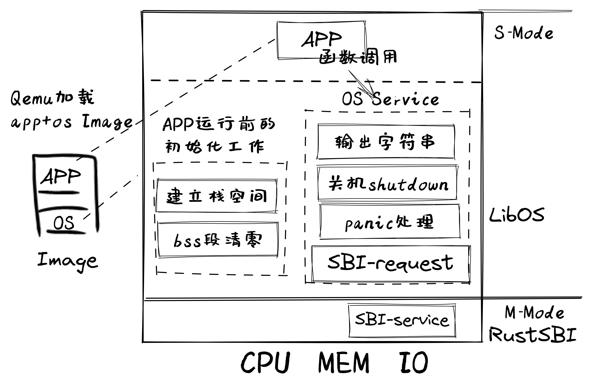

-------------------------------------------------------------------
# ch1:应用程序与基本执行环境
目标:让应用与硬件隔离(操作系统的主要功能)
解决:如何设计和实现建立在裸机上的执行环境，并让应用程序能够在这样的执行环境中运行
-------------------------------------------------------------------
LOG=TRACE make run     指定LOG级别为TRACE，查看重要程度不低于TRACE的输出日志
-------------------------------------------------------------------
1.load:Qemu把app和libos的image镜像加载到内存

2.init:RustSBI完成基本硬件初始化，跳转到libos起始位置完成app运行前的初始化(建立栈空间和清零bss段)

3.run:跳转app运行，函数调用得到libos的OS服务

-------------------------------------------------------------------
./os/src
Rust        4 Files   119 Lines
Assembly    1 Files    11 Lines

├── bootloader(内核依赖的运行在 M 特权级的 SBI 实现，本项目中我们使用 RustSBI)
│   └── rustsbi-qemu.bin(可运行在 qemu 虚拟机上的预编译二进制版本)
├── LICENSE
├── os(我们的内核实现放在 os 目录下)
│   ├── Cargo.toml(内核实现的一些配置文件)
│   ├── Makefile
│   └── src(所有内核的源代码放在 os/src 目录下)
│       ├── console.rs(将打印字符的 SBI 接口进一步封装实现更加强大的格式化输出)
│       ├── entry.asm(设置内核执行环境的的一段汇编代码)
│       ├── lang_items.rs(需要我们提供给 Rust 编译器的一些语义项，目前包含内核 panic 时的处理逻辑)
│       ├── linker-qemu.ld(控制内核内存布局的链接脚本以使内核运行在 qemu 虚拟机上)
│       ├── main.rs(内核主函数)
│       └── sbi.rs(调用底层 SBI 实现提供的 SBI 接口)
├── README.md
└── rust-toolchain(控制整个项目的工具链版本)
-------------------------------------------------------------------
# 接下来熟悉一下裸机环境的ch1流程
-------------------------------------------------------------------
先在Linux上开发并运行一个简单的 “Hello, world” 应用程序

$cargo new os --bin
$tree os

os
├── Cargo.toml
└── src
    └── main.rs

1 directory, 2 files

$cd os
$cargo run

 Compiling os v0.1.0 (/home/shinbokuow/workspace/v3/rCore-Tutorial-v3/os)
    Finished dev [unoptimized + debuginfo] target(s) in 1.15s
     Running `target/debug/os`
Hello, world!
-------------------------------------------------------------------

-------------------------------------------------------------------