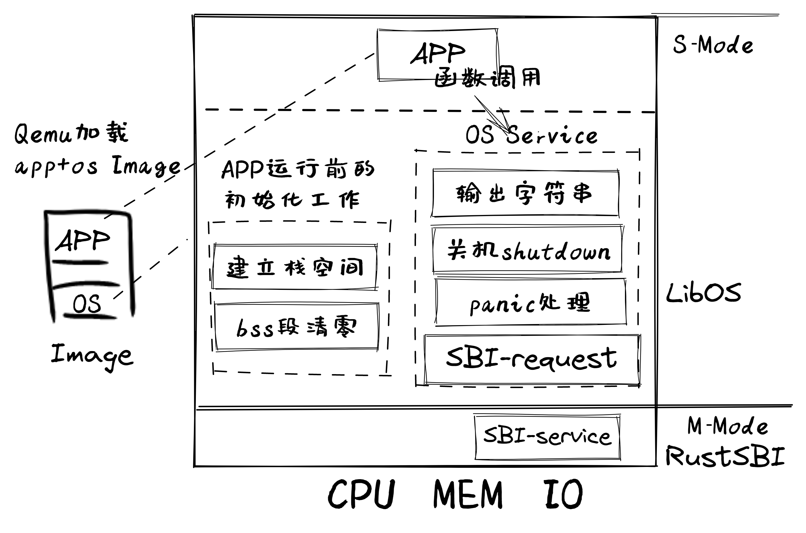
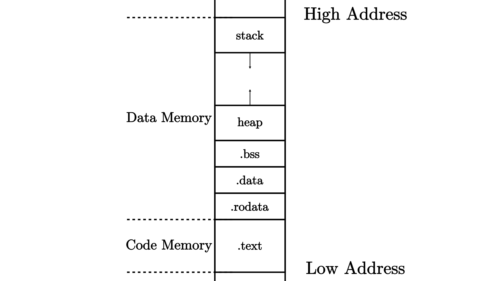

-------------------------------------------------------------------
# ch1:应用程序与基本执行环境
目标:让应用与硬件隔离(操作系统的主要功能)
解决:如何设计和实现建立在裸机上的执行环境，并让应用程序能够在这样的执行环境中运行

-------------------------------------------------------------------
LOG=TRACE make run     指定LOG级别为TRACE，查看重要程度不低于TRACE的输出日志

-------------------------------------------------------------------
1.load:Qemu把app和libos的image镜像加载到内存

2.init:RustSBI完成基本硬件初始化，跳转到libos起始位置完成app运行前的初始化(建立栈空间和清零bss段)

3.run:跳转app运行，函数调用得到libos的OS服务


-------------------------------------------------------------------
./os/src
Rust        4 Files   119 Lines
Assembly    1 Files    11 Lines

├── bootloader(内核依赖的运行在 M 特权级的 SBI 实现，本项目中我们使用 RustSBI)
│   └── rustsbi-qemu.bin(可运行在 qemu 虚拟机上的预编译二进制版本)
├── LICENSE
├── os(我们的内核实现放在 os 目录下)
│   ├── Cargo.toml(内核实现的一些配置文件)
│   ├── Makefile
│   └── src(所有内核的源代码放在 os/src 目录下)
│       ├── console.rs(将打印字符的 SBI 接口进一步封装实现更加强大的格式化输出)
│       ├── entry.asm(设置内核执行环境的的一段汇编代码)
│       ├── lang_items.rs(需要我们提供给 Rust 编译器的一些语义项，目前包含内核 panic 时的处理逻辑)
│       ├── linker-qemu.ld(控制内核内存布局的链接脚本以使内核运行在 qemu 虚拟机上)
│       ├── main.rs(内核主函数)
│       └── sbi.rs(调用底层 SBI 实现提供的 SBI 接口)
├── README.md
└── rust-toolchain(控制整个项目的工具链版本)

-------------------------------------------------------------------
先在Linux上开发并运行一个简单的 “Hello, world” 应用程序
```
$cargo new os --bin
$tree os
```
os
├── Cargo.toml
└── src
    └── main.rs

1 directory, 2 files
```
$cd os
$cargo run
```
 Compiling os v0.1.0 (/home/shinbokuow/workspace/v3/rCore-Tutorial-v3/os)
    Finished dev [unoptimized + debuginfo] target(s) in 1.15s
     Running `target/debug/os`
Hello, world!
```
$ strace target/debug/os
```
可以查看系统调用

-------------------------------------------------------------------
```
$rustc --version --verbose
```
   rustc 1.57.0-nightly (e1e9319d9 2021-10-14)
   binary: rustc
   commit-hash: e1e9319d93aea755c444c8f8ff863b0936d7a4b6
   commit-date: 2021-10-14
   host: x86_64-unknown-linux-gnu
   release: 1.57.0-nightly
   LLVM version: 13.0.0
   Rust编译器通过 目标三元组 (Target Triplet) 来描述一个软件运行的目标平台。它一般包括 CPU、操作系统和运行时库等信息，从而控制Rust编译器可执行代码生成: 其中的 host 一项可以看出默认的目标平台是 x86_64-unknown-linux-gnu，其中 CPU 架构是 x86_64，CPU 厂商是 unknown，操作系统是 linux，运行时库是 GNU libc（封装了 Linux 系统调用，并提供 POSIX 接口为主的函数库）

   我们希望能够在另一个硬件平台上运行程序，即将 CPU 架构从 x86_64 换成 RISC-V
```
$rustc --print target-list | grep riscv
```
   通过上面命令可以看一下目前 Rust 编译器支持哪些基于 RISC-V 的目标平台
    riscv32gc-unknown-linux-gnu
    riscv32gc-unknown-linux-musl
    riscv32i-unknown-none-elf
    riscv32im-risc0-zkvm-elf
    riscv32im-unknown-none-elf
    riscv32ima-unknown-none-elf
    riscv32imac-esp-espidf
    riscv32imac-unknown-none-elf
    riscv32imac-unknown-xous-elf
    riscv32imafc-esp-espidf
    riscv32imafc-unknown-none-elf
    riscv32imc-esp-espidf
    riscv32imc-unknown-none-elf
    riscv64-linux-android
    riscv64gc-unknown-freebsd
    riscv64gc-unknown-fuchsia
    riscv64gc-unknown-hermit
    riscv64gc-unknown-linux-gnu
    riscv64gc-unknown-linux-musl
    riscv64gc-unknown-netbsd
    riscv64gc-unknown-none-elf
    riscv64gc-unknown-openbsd
    riscv64imac-unknown-none-elf
我们选择 riscv64gc-unknown-none-elf 目标平台
中的 CPU 架构是 riscv64gc ，CPU厂商是 unknown ，操作系统是 none ， elf 表示没有标准的运行时库（表明没有任何系统调用的封装支持），但可以生成 ELF 格式的执行程序

以上实现为了实现裸机环境的目的

-------------------------------------------------------------------
切换平台：
```
$cargo run --target riscv64gc-unknown-none-elf
```
    报错了因为我们已经在 rustup 工具链中安装了这个目标平台支持，因此并不是该目标平台未安装的问题
    这个问题只是单纯的表示在这个目标平台上找不到 Rust 标准库 std；所选的目标平台不存在任何操作系统支持
    这样的平台通常被我们称为 裸机平台 (bare-metal)

-------------------------------------------------------------------
最简单的 Rust 应用程序进行改造使得它能够被编译到 RV64GC 裸机平台上：

-------------------------------------------------------------------
尝试移除 println! 宏及其所在的标准库:构建运行在裸机上的操作系统，就不能再依赖标准库了
```
$rustup target add riscv64gc-unknown-none-elf
```
由于后续实验需要 rustc 编译器缺省生成RISC-V 64的目标代码，所以我们首先要给 rustc 添加一个target : riscv64gc-unknown-none-elf
```
$ vim os/.cargo/config 添加如下

[build]
target = "riscv64gc-unknown-none-elf"
```
交叉编译

-------------------------------------------------------------------
```
$ cargo build
```
如果报std未找到错，就在 main.rs 的开头加上一行 \#![no_std]
```
$ cargo build
```
继续报错是因为println宏由标准库std提供，且会使用到一个名为 write 的系统调用
现在我们的代码功能还不足以自己实现一个 println!宏；不能在核心库 core 中找到系统调用
通过//注释掉println!来先暂时跳过

-------------------------------------------------------------------
```
$ cargo build
```
又又又报错了error: `#[panic_handler]` function required, but not found
Rust编译器在编译程序时，从安全性考虑，需要有 panic! 宏的具体实现
缺少panic!宏
panic! 宏最典型的应用场景包括断言宏 assert! 失败或者对 Option::None/Result::Err 进行 unwrap 操作

-------------------------------------------------------------------
我们创建一个新的子模块 lang_items.rs 实现panic函数
```
// os/src/lang_items.rs

use core::panic::PanicInfo;

#[panic_handler]
fn panic(_info: &PanicInfo) -> ! {
    loop {}
}
```
并通过 #[panic_handler] 属性通知编译器用panic函数来对接 panic! 宏
之后我们会从 PanicInfo 解析出错位置并打印出来，然后杀死应用程序。但目前我们什么都不做只是在原地 loop
```
// os/src/main.rs
#![no_std]
mod lang_items;
// ... other code
```
为了将该子模块添加到项目中，我们还需要在 main.rs 的 #![no_std] 的下方加上 mod lang_items

-------------------------------------------------------------------
```
$ cargo build
```
error: using `fn main` requires the standard library
移除 main 函数

(start 语义项代表了标准库 std 在执行应用程序之前需要进行的一些初始化工作)

我们在 main.rs 的开头加入设置 #![no_main] 告诉编译器我们没有一般意义上的 main 函数，并将原来的 main 函数删除
在失去了 main 函数的情况下，编译器也就不需要完成所谓的初始化工作了

-------------------------------------------------------------------
```
$ cargo build
```
至此成功编译完通过

目前的主要代码包括 main.rs 和 lang_items.rs 
```
// os/src/main.rs
#![no_main]
#![no_std]
mod lang_items;
// ... other code


// os/src/lang_items.rs
use core::panic::PanicInfo;

#[panic_handler]
fn panic(_info: &PanicInfo) -> ! {
    loop {}
}
```
-------------------------------------------------------------------
分析被移除标准库的程序：
对于上面这个被移除标准库的应用程序，通过了Rust编译器的检查和编译，形成了二进制代码
但这个二进制代码的内容是什么，它能否在RISC-V 64计算机上正常执行呢？
为了分析这个二进制可执行程序，首先需要安装 cargo-binutils 工具集：
```
$ cargo install cargo-binutils
$ rustup component add llvm-tools-preview
```
-------------------------------------------------------------------
#从这里之后是旧版本指导书内容
-------------------------------------------------------------------
```
$ file target/riscv64gc-unknown-none-elf/debug/os
```
可以查看文件进行分析:
target/riscv64gc-unknown-none-elf/debug/os: ELF 64-bit LSB executable, UCB RISC-V, RVC, double-float ABI, version 1 (SYSV), statically linked, with debug_info, not stripped
```
$ rust-readobj -h target/riscv64gc-unknown-none-elf/debug/os
```
查看文件头信息:
File: target/riscv64gc-unknown-none-elf/debug/os
Format: elf64-littleriscv
Arch: riscv64
AddressSize: 64bit
LoadName: <Not found>
ElfHeader {
  Ident {
    Magic: (7F 45 4C 46)
    Class: 64-bit (0x2)
    DataEncoding: LittleEndian (0x1)
    FileVersion: 1
    OS/ABI: SystemV (0x0)
    ABIVersion: 0
    Unused: (00 00 00 00 00 00 00)
  }
  Type: Executable (0x2)
  Machine: EM_RISCV (0xF3)
  Version: 1
  Entry: 0x0
  ProgramHeaderOffset: 0x40
  SectionHeaderOffset: 0x10E0
  Flags [ (0x5)
    EF_RISCV_FLOAT_ABI_DOUBLE (0x4)
    EF_RISCV_RVC (0x1)
  ]
  HeaderSize: 64
  ProgramHeaderEntrySize: 56
  ProgramHeaderCount: 4
  SectionHeaderEntrySize: 64
  SectionHeaderCount: 12
  StringTableSectionIndex: 10
}

通过 file 工具对二进制程序 os 的分析可以看到它好像是一个合法的 RISC-V 64 可执行程序，但通过 rust-readobj 工具进一步分析，发现它的入口地址 Entry 是 0 ，从 C/C++ 等语言中得来的经验告诉我们， 0 一般表示 NULL 或空指针，因此等于 0 的入口地址看上去无法对应到任何指令。再通过 rust-objdump 工具把它反汇编，可以看到没有生成汇编代码
所以，我们可以断定，这个二进制程序虽然合法，但它是一个空程序。产生该现象的原因是：目前我们的程序（参考上面的源代码）没有进行任何有意义的工作，由于我们移除了 main 函数并将项目设置为 #![no_main] ，它甚至没有一个传统意义上的入口点（即程序首条被执行的指令所在的位置），因此 Rust 编译器会生成一个空程序
```
$ rust-objdump -S target/riscv64gc-unknown-none-elf/debug/os
```
反汇编导出汇编程序:
target/riscv64gc-unknown-none-elf/debug/os:     file format elf64-littleriscv

-------------------------------------------------------------------
qemu模拟器上实现内核运行与检验:主要是为了方便快捷，只需在命令行输入一行命令即可让内核跑起来
使用软件 qemu-system-riscv64 来模拟一台 64 位 RISC-V 架构的计算机，它包含CPU 、物理内存以及若干 I/O 外设
启动 Qemu:
通过各章的os/Makefile文件可以查看
```
$ qemu-system-riscv64 \
    -machine virt \
    -nographic \
    -bios ../bootloader/rustsbi-qemu.bin \
    -device loader,file=target/riscv64gc-unknown-none-elf/release/os.bin,addr=0x80200000

//-machine virt 计算机名为virt
//-nographic 不需要图解（图形界面），只对外输出字符流
//-bios +加载引导程序，在与os同级的bootloader目录下（在每章分支中可以查看）
//-device  loader属性可以在Qemu模拟器开机之前将一个宿主机上的文件载入到Qemu的物理内存的指定位置中
           file 和 addr 属性分别可以设置待载入文件的路径以及将文件载入到的 Qemu 物理内存上的物理地址
           示例中os.bin为内核镜像
```
-------------------------------------------------------------------
在 Qemu 开始执行任何指令之前，首先把两个文件加载到 Qemu 的物理内存中：即作把作为 bootloader 的 rustsbi-qemu.bin 加载到物理内存以物理地址 0x80000000 开头的区域上，同时把内核镜像 os.bin 加载到以物理地址 0x80200000 开头的区域上
计算机加电之后的启动流程可以分成若干个阶段，每个阶段均由一层软件或固件负责，1.每一层软件或固件的功能是进行它应当承担的初始化工作，2.并在此之后跳转到下一层软件或固件的入口地址，也就是将计算机的控制权移交给了下一层软件或固件

Qemu 模拟的启动流程则可以分为三个阶段：第一个阶段由固化在 Qemu 内的一小段汇编程序负责；第二个阶段由 bootloader 负责；第三个阶段则由内核镜像负责

第一阶段:将必要的文件载入到 Qemu 物理内存之后，Qemu CPU 的程序计数器（PC, Program Counter）会被初始化为 0x1000，因此 Qemu 实际执行的第一条指令位于物理地址 0x1000 ，接下来它将执行寥寥数条指令并跳转到物理地址 0x80000000 对应的指令处并进入第二阶段
第二阶段:将负责第二阶段的 bootloader rustsbi-qemu.bin 放在以物理地址 0x80000000 开头的物理内存中，这样就能保证 0x80000000 处正好保存 bootloader 的第一条指令,bootloader 负责对计算机进行一些初始化工作,接着跳转到下一条指令地址，入口地址可能是一个预先约定好的固定的值，也有可能是在 bootloader 运行期间才动态获取到的值
第三阶段:一旦 CPU 开始执行内核的第一条指令，证明计算机的控制权已经被移交给我们的内核，也就达到了本节的目标

-------------------------------------------------------------------

字节至少可以分成代码和数据两部分，在程序运行起来的时候它们的功能并不相同：代码部分由一条条可以被 CPU 解码并执行的指令组成，而数据部分只是被 CPU 视作可读写的内存空间。事实上我们还可以根据其功能进一步把两个部分划分为更小的单位： 段 (Section)

.text 存放程序的所有汇编代码
数据部分:
.rodata已初始化的不可修改的全局变量，如常量
.data已初始化的可以被修改的全局变量
.bss 保存程序中那些未初始化的全局数据，通常由程序的加载者代为进行零初始化，即将这块区域逐字节清零
堆存储动态分配的数据，向高地址增长
栈不仅用作函数调用上下文的保存与恢复，每个函数作用域内的局部变量也被编译器放在它的栈帧内，向低地址增长

-------------------------------------------------------------------
编译流程：
1.编译器：将每个源文件从某门高级编程语言转化为汇编语言
2.汇编器：将上一步的每个源文件中的文本格式的指令转化为机器码（一个二进制的目标文件）.o文件
3.链接器：将所有目标文件和其所需的外部目标文件链接在一起形成一个完整的可执行文件

-------------------------------------------------------------------
```
 # os/src/entry.asm
     .section .text.entry
     .globl _start
 _start:
     li x1, 100
```
第3行.globl _start我们告知编译器 _start 是一个全局符号，因此可以被其他目标文件使用
第2行表明我们希望将第2行后面的内容全部放到一个名为 .text.entry 的段中

-------------------------------------------------------------------
```
// os/src/main.rs
#![no_std]
#![no_main]

mod lang_items;

use core::arch::global_asm;
global_asm!(include_str!("entry.asm"));
```
我们通过 include_str! 宏将同目录下的汇编代码 entry.asm 转化为字符串并通过 global_asm! 宏嵌入到代码中

-------------------------------------------------------------------
由于链接器默认的内存布局并不能符合我们的要求，为了实现与 Qemu 正确对接，我们可以通过 链接脚本 (Linker Script) 调整链接器的行为
内核第一条指令的地址应该位于 0x80200000 
```
// os/.cargo/config
 [build]
 target = "riscv64gc-unknown-none-elf"

 [target.riscv64gc-unknown-none-elf]
 rustflags = [
     "-Clink-arg=-Tsrc/linker.ld", "-Cforce-frame-pointers=yes"
 ]
```


 链接脚本 os/src/linker.ld 如下：
```
OUTPUT_ARCH(riscv)
ENTRY(_start)
BASE_ADDRESS = 0x80200000;

SECTIONS
{
    . = BASE_ADDRESS;
    skernel = .;

    stext = .;
    .text : {
        *(.text.entry)
        *(.text .text.*)
    }

    . = ALIGN(4K);
    etext = .;
    srodata = .;
    .rodata : {
        *(.rodata .rodata.*)
        *(.srodata .srodata.*)
    }

    . = ALIGN(4K);
    erodata = .;
    sdata = .;
    .data : {
        *(.data .data.*)
        *(.sdata .sdata.*)
    }

    . = ALIGN(4K);
    edata = .;
    .bss : {
        *(.bss.stack)
        sbss = .;
        *(.bss .bss.*)
        *(.sbss .sbss.*)
    }

    . = ALIGN(4K);
    ebss = .;
    ekernel = .;

    /DISCARD/ : {
        *(.eh_frame)
    }
}
```
设置了目标平台为 riscv，设置了整个程序的入口点为之前定义的全局符号 _start
定义了一个常量 BASE_ADDRESS 为 0x80200000 ，也就是我们之前提到内核的初始化代码被放置的地址
后面开始体现了链接过程中对输入的目标文件的段的合并
. 表示当前地址，也就是链接器会从它指向的位置开始往下放置从输入的目标文件中收集来的段
我们可以对 . 进行赋值来调整接下来的段放在哪里，也可以创建一些全局符号赋值为 . 从而记录这一时刻的位置

-------------------------------------------------------------------
```
.rodata : {
    *(.rodata)
}
```
冒号前面表示最终生成的可执行文件的一个段的名字，花括号内按照放置顺序描述将所有输入目标文件的哪些段放在这个段中

-------------------------------------------------------------------
```
$ cargo build --release
```
Finished `release` profile [optimized] target(s) in 0.15s
以 release 模式生成了内核可执行文件，它的位置在 os/target/riscv64gc.../release/os 
```
$ file target/riscv64gc-unknown-none-elf/release/os
target/riscv64gc-unknown-none-elf/release/os: ELF 64-bit LSB executable, UCB RISC-V, RVC, double-float ABI, version 1 (SYSV), statically linked, not stripped
```
file 工具查看它的属性，可以看到它是一个运行在 64 位 RISC-V 架构计算机上的可执行文件，它是静态链接得到的

-------------------------------------------------------------------
手动加载内核可执行文件:

我们直接将内核可执行文件 os 提交给 Qemu ，而 Qemu 会将整个可执行文件不加处理的加载到 Qemu 内存的 0x80200000 处，由于内核可执行文件的开头是一段元数据，这会导致 Qemu 内存 0x80200000 处无法找到内核第一条指令，也就意味着 RustSBI 无法正常将计算机控制权转交给内核
$ rust-objcopy --strip-all target/riscv64gc-unknown-none-elf/release/os -O binary target/riscv64gc-unknown-none-elf/release/os.bin
将元数据丢弃得到的内核镜像 os.bin 被加载到 Qemu 之后，则可以在 0x80200000 处正确找到内核第一条指令

-------------------------------------------------------------------
我们可以使用 stat 工具来比较内核可执行文件和内核镜像的大小：
```
$ stat target/riscv64gc-unknown-none-elf/release/os

$ stat target/riscv64gc-unknown-none-elf/release/os.bin
```
-------------------------------------------------------------------
# 因为没有框架代码也就是rustbi以及bootloader文件夹，所以以下了解就行
-------------------------------------------------------------------
在 os 目录下通过以下命令启动 Qemu 并加载 RustSBI 和内核镜像:
```
$ qemu-system-riscv64 \
    -machine virt \
    -nographic \
    -bios ../bootloader/rustsbi-qemu.bin \
    -device loader,file=target/riscv64gc-unknown-none-elf/release/os.bin,addr=0x80200000 \
    -s -S
```
-s 可以使 Qemu 监听本地 TCP 端口 1234 等待 GDB 客户端连接，而 -S 可以使 Qemu 在收到 GDB 的请求后再开始运行。因此，Qemu 暂时没有任何输出。注意，如果不想通过 GDB 对于 Qemu 进行调试而是直接运行 Qemu 的话，则要删掉最后一行的 -s -S

-------------------------------------------------------------------
打开另一个终端，启动一个 GDB 客户端连接到 Qemu ：
```
$ riscv64-unknown-elf-gdb \
      -ex 'file target/riscv64gc-unknown-none-elf/release/os' \
      -ex 'set arch riscv:rv64' \
      -ex 'target remote localhost:1234'
```
接下来就是gdb的调试操作知识了，不再扩展

-------------------------------------------------------------------
4.14:
woc，看错指导书了，之前解决no_main后的内容是2021年的指导书
以及没用entry.asm

-------------------------------------------------------------------

