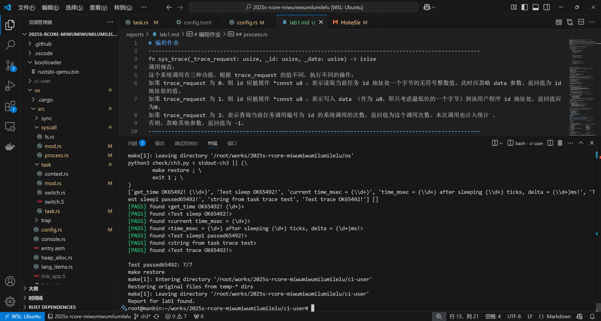

# 编程作业
------------------------------------------------------------------------------------------------------
fn sys_trace(_trace_request: usize, _id: usize, _data: usize) -> isize
调用规范：
这个系统调用有三种功能，根据 trace_request 的值不同，执行不同的操作：
如果 trace_request 为 0，则 id 应被视作 *const u8 ，表示读取当前任务 id 地址处一个字节的无符号整数值。此时应忽略 data 参数。返回值为 id 地址处的值。
如果 trace_request 为 1，则 id 应被视作 *const u8 ，表示写入 data （作为 u8，即只考虑最低位的一个字节）到该用户程序 id 地址处。返回值应为0。
如果 trace_request 为 2，表示查询当前任务调用编号为 id 的系统调用的次数，返回值为这个调用次数。本次调用也计入统计 。
否则，忽略其他参数，返回值为 -1。
------------------------------------------------------------------------------------------------------
## process.rs
------------------------------------------------------------------------------------------------------
// os/src/process.rs

找到sys_trace函数,根据题目的调用规范进行编写match函数，容易得到0,1,_的匹配

// TODO: implement the syscall
pub fn sys_trace(_trace_request: usize, _id: usize, _data: usize) -> isize {
    trace!("kernel: sys_trace");

    match _trace_request {
        0 => {
            // id 应被视作 *const u8，读取地址处的值
            let id_ptr = _id as *const u8;
            unsafe {
                if let Some(value) = id_ptr.as_ref() {
                    *value as isize
                } else {
                    -1
                }
            }
        }
        1 => {
            // id 应被视作 *mut u8，写入 data 的最低字节
            let id_ptr = _id as *mut u8;
            unsafe {
                if let Some(value) = id_ptr.as_mut() {
                    *value = (_data & 0xff) as u8;
                    0
                } else {
                    -1
                }
            }
        }
        2 => {
            // 查询当前任务调用编号为 id 的系统调用次数
            if _id >= MAX_SYSCALL_NUM {
                return -1;
            }
            let syscall_times = crate::task::get_sys_call_times();
            syscall_times[_id] as isize
        }
        _ => {
            -1
        }
    }
}

------------------------------------------------------------------------------------------------------
对2的匹配：查询当前任务id对应的系统调用次数

syscall_time 是一个固定大小的数组（[u32; MAX_SYSCALL_NUM]），其有效索引范围是 0..MAX_SYSCALL_NUM
所以要检查是否数组越界

MAX_SYSCALL_NUM是我们自己定义的
所以要在该文件开头加上他的调用
use crate::{
    task::{exit_current_and_run_next, suspend_current_and_run_next},
    timer::get_time_us,
    config::MAX_SYSCALL_NUM,
};

定义在os下的config.rs文件中,该文件存放宏定义，且一般都大写
此处注意要加上注释，因为是被规范了的，否则会报错
///
pub const MAX_SYSCALL_NUM: usize = 500;

syscall_times是定义的一个数组用来接受所调用的task.rs中的get_sys_call_times()函数的返回值，后续会讲
最后返回对应id的元素即可
------------------------------------------------------------------------------------------------------
现在已经完成了大致框架代码，只需要完成对应规范中所要求的调用次数+1和获取相应函数即可
------------------------------------------------------------------------------------------------------
## task/mod.rs
------------------------------------------------------------------------------------------------------
观察本文件的大致代码，可以知道先在最后加上：

/// Increase the sys call count
pub fn increase_sys_call(sys_id: usize) {
    TASK_MANAGER.increase_sys_call(sys_id);
}

/// return the sys count array of the current task
pub fn get_sys_call_times() -> [u32; MAX_SYSCALL_NUM] {
    TASK_MANAGER.get_sys_call_times()
}

包装用来全局使用
------------------------------------------------------------------------------------------------------
然后在相应结构体对应的方法中加入这两个函数的具体实现：

fn increase_sys_call(&self, sys_id: usize) {
    // 获取对 TaskManagerInner 的可变独占访问
    //同步机制修改确保在访问期间没有其他代码能修改 TaskManagerInner，避免数据竞争
    //RefMut 是 Rust 中 RefCell 的可变借用标记，会在作用域结束时自动释放锁
    let mut inner: core::cell::RefMut<'_, TaskManagerInner> = self.inner.exclusive_access();
    // 获取当前运行的任务索引
    let current_task = inner.current_task;
    inner.tasks[current_task].syscall_time[sys_id] += 1;
}

fn get_sys_call_times(&self) -> [u32; MAX_SYSCALL_NUM] {
    let inner: core::cell::RefMut<'_, TaskManagerInner> = self.inner.exclusive_access();
    // 返回当前任务的系统调用统计副本
    inner.tasks[inner.current_task].syscall_time.clone()
}

------------------------------------------------------------------------------------------------------
最后创建实例中加入数组的定义，对应上面两个方法的载体:

    pub static ref TASK_MANAGER: TaskManager = {
        let num_app = get_num_app();
        let mut tasks = [TaskControlBlock {
            task_cx: TaskContext::zero_init(),
            task_status: TaskStatus::UnInit,
            syscall_time: [0; MAX_SYSCALL_NUM], //对应也需要在开头加上use crate::config::MAX_SYSCALL_NUM
        }; MAX_APP_NUM];
------------------------------------------------------------------------------------------------------
## syscall/mod.rs
------------------------------------------------------------------------------------------------------
此时就可以在每次系统调用的时候进行计数了，也就是+1的操作：

use crate::task::increase_sys_call;

pub fn syscall(syscall_id: usize, args: [usize; 3]) -> isize {
    increase_sys_call(syscall_id);
    match syscall_id {
        SYSCALL_WRITE => sys_write(args[0], args[1] as *const u8, args[2]),
        SYSCALL_EXIT => sys_exit(args[0] as i32),
        SYSCALL_YIELD => sys_yield(),
        SYSCALL_GET_TIME => sys_get_time(args[0] as *mut TimeVal, args[1]),
        SYSCALL_TRACE => sys_trace(args[0], args[1], args[2]),
        _ => panic!("Unsupported syscall_id: {}", syscall_id),
    }
}
------------------------------------------------------------------------------------------------------
## task.rs
------------------------------------------------------------------------------------------------------
在之前的实例化中添加的元素相应的对应到TaskControlBlock结构体的定义中加入一个新元素:

use crate::config::MAX_SYSCALL_NUM;

pub struct TaskControlBlock {
    /// The task status in it's lifecycle
    pub task_status: TaskStatus,
    /// The task context
    pub task_cx: TaskContext,
    /// syscall time count,定义为数组
    pub syscall_time: [u32; MAX_SYSCALL_NUM],
}
------------------------------------------------------------------------------------------------------
测试的时候，可以看Makefile文件：
// user/Makefile
将base=0 改为2
------------------------------------------------------------------------------------------------------
# 简答作业
------------------------------------------------------------------------------------------------------
深入理解 trap.S 中两个函数 __alltraps 和 __restore 的作用，并回答如下问题:
------------------------------------------------------------------------------------------------------
## 刚进入 __restore 时，sp 代表了什么值。请指出 __restore 的两种使用情景
------------------------------------------------------------------------------------------------------
__restore:

 1.macro LOAD_GP n                                                   //宏定义 LOAD_GP​,与SAVE_GP对称
 2    ld x\n, \n*8(sp)
 3.endm
 4
 5__restore:
 6    # case1: start running app by __restore
 7    # case2: back to U after handling trap
 8    mv sp, a0                                                     //将参数a0（指向内核栈上的TrapContext）赋给sp   
 9    # now sp->kernel stack(after allocated), sscratch->user stack
10    # restore sstatus/sepc
11    ld t0, 32*8(sp)                                               //加载 sstatus
12    ld t1, 33*8(sp)                                               //加载 sepc
13    ld t2, 2*8(sp)                                                //加载用户栈指针（原x2）
14    csrw sstatus, t0                                              //恢复处理器状态
15    csrw sepc, t1                                                 //设置返回地址
16    csrw sscratch, t2                                             //保存用户栈到 sscratch
17    # restore general-purpuse registers except sp/tp
18    ld x1, 1*8(sp)                                                //恢复返回地址（ra）
19    ld x3, 3*8(sp)                                                //恢复全局指针（gp）
20    .set n, 5                                 
21    .rept 27                                                      //恢复 x5~x31
22        LOAD_GP %n
23        .set n, n+1
24    .endr
25    # release TrapContext on kernel stack
26    addi sp, sp, 34*8                                             //释放 TrapContext 空间
27    # now sp->kernel stack, sscratch->user stack
28    csrrw sp, sscratch, sp                                        //切换回用户栈
29    sret

Trap 处理的总体流程如下：首先通过 __alltraps 将 Trap 上下文保存在内核栈上，然后跳转到使用 Rust 编写的 trap_handler 函数 完成 Trap 分发及处理。当 trap_handler 返回之后，使用 __restore 从保存在内核栈上的 Trap 上下文恢复寄存器。最后通过一条 sret 指令回到应用程序执行

sp指向用户栈的栈顶;
系统调用返回（syscall 返回用户态）​，需要恢复用户态的执行上下文
信号处理返回（trap_handler 返回）​,当用户态的信号处理函数执行完毕后，需要恢复被信号中断前的原始上下文
------------------------------------------------------------------------------------------------------
## 这几行汇编代码特殊处理了哪些寄存器？这些寄存器的的值对于进入用户态有何意义？请分别解释
ld t0, 32*8(sp)
ld t1, 33*8(sp)
ld t2, 2*8(sp)
csrw sstatus, t0
csrw sepc, t1
csrw sscratch, t2
------------------------------------------------------------------------------------------------------
11    ld t0, 32*8(sp)                                               //加载 sstatus
12    ld t1, 33*8(sp)                                               //加载 sepc
13    ld t2, 2*8(sp)                                                //加载用户栈指针（原x2）
14    csrw sstatus, t0                                              //恢复处理器状态
15    csrw sepc, t1                                                 //设置返回地址
16    csrw sscratch, t2                                             //保存用户栈到 sscratch
操作系统内核完成异常处理（如系统调用、中断）后，准备返回到用户态时的上下文恢复流程
------------------------------------------------------------------------------------------------------
## 为何跳过了 x2 和 x4
ld x1, 1*8(sp)
ld x3, 3*8(sp)
.set n, 5
.rept 27
   LOAD_GP %n
   .set n, n+1
.endr
------------------------------------------------------------------------------------------------------
 //跳过 x2（sp）​​：在代码片段之前x2对应的用户栈指针保存到了sscratch寄存器, 不需要从内核栈中进行恢复
 //​跳过 x4（tp）​​：线程指针通常由内核管理，用户程序无需修改
------------------------------------------------------------------------------------------------------
## 该指令之后，sp 和 sscratch 中的值分别有什么意义
csrrw sp, sscratch, sp
------------------------------------------------------------------------------------------------------
sp->sscratch->sp 两个寄存器值互换
sp指向用户栈, sscratch指向内核栈
------------------------------------------------------------------------------------------------------
## __restore：中发生状态切换在哪一条指令？为何该指令执行之后会进入用户态？
------------------------------------------------------------------------------------------------------
sret后
其 sepc 是应用程序入口地址 0x80400000 ，其 sp 寄存器指向用户栈，其 sstatus 的 SPP 字段被设置为 User 
发生该指令后PC设置为 sepc 寄存器的值
------------------------------------------------------------------------------------------------------
## 该指令之后，sp 和 sscratch 中的值分别有什么意义？
csrrw sp, sscratch, sp
------------------------------------------------------------------------------------------------------
寄存器的内容交换, sp保存了内核栈指针, sscratch保存用户栈指针
------------------------------------------------------------------------------------------------------
## 从 U 态进入 S 态是哪一条指令发生的？
------------------------------------------------------------------------------------------------------
ecall指令

在运行应用程序之前要完成如下这些工作：
跳转到应用程序入口点 0x80400000
将使用的栈切换到用户栈
在 __alltraps 时我们要求 sscratch 指向内核栈，这个也需要在此时完成
从 S 特权级切换到 U 特权级

//ecall指令长度为4字节，sepc +=4确保返回到下一条指令,避免死循环
        cx.sepc += 4;
------------------------------------------------------------------------------------------------------
# 荣誉准则
------------------------------------------------------------------------------------------------------
1.在完成本次实验的过程（含此前学习的过程）中，我曾分别与 以下各位 就（与本次实验相关的）以下方面做过交流，还在代码中对应的位置以注释形式记录了具体的交流对象及内容：

nonsence小组成员,魔法图书馆小组成员

2.此外，我也参考了 以下资料 ，还在代码中对应的位置以注释形式记录了具体的参考来源及内容：

[《你参考的资料说明》](https://learningos.cn/rCore-Tutorial-Guide-2025S/chapter3/)

3. 我独立完成了本次实验除以上方面之外的所有工作，包括代码与文档。 我清楚地知道，从以上方面获得的信息在一定程度上降低了实验难度，可能会影响起评分。

4. 我从未使用过他人的代码，不管是原封不动地复制，还是经过了某些等价转换。 我未曾也不会向他人（含此后各届同学）复制或公开我的实验代码，我有义务妥善保管好它们。 我提交至本实验的评测系统的代码，均无意于破坏或妨碍任何计算机系统的正常运转。 我清楚地知道，以上情况均为本课程纪律所禁止，若违反，对应的实验成绩将按“-100”分计。
------------------------------------------------------------------------------------------------------
