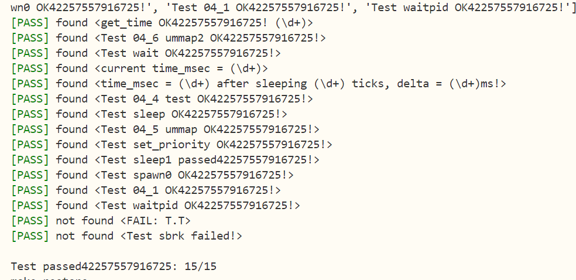

# 编程作业
-------------------------------------------------------------------------
## sys_get_time迁移
-------------------------------------------------------------------------
```
pub fn sys_get_time(_ts: *mut TimeVal, _tz: usize) -> isize {
    trace!(
        "kernel:pid[{}] sys_get_time NOT IMPLEMENTED",
        current_task().unwrap().pid.0
    );
    let us = get_time_us();
    let token = current_user_token();
    let ts = user_ptr_to_kernel_ref(token, _ts );
    *ts = TimeVal {
        sec : us / 1_000_000,
        usec : us % 1_000_000,
    };
    0    
}
```
```
/// Translate a ptr[u8] array through page table and return a mutable reference of T
pub fn user_ptr_to_kernel_ref<T>(token: usize, ptr: *mut T) -> &'static mut T {
    //根据 token 创建一个 PageTable 实例，用于操作用户态的页表
    let page_table = PageTable::from_token(token);
    //将用户态指针 ptr 转换为虚拟地址 VirtAddr 类型
    let v = VirtAddr::from(ptr as usize);
    //获取偏移量
    let offset = v.page_offset();
    //将虚拟地址转换为虚拟页号
    let vpn = v.floor();
    //将虚拟页号翻译成对应页表项并返回
    let mut p: PhysAddr = page_table.translate(vpn).unwrap().ppn().into();
    //将页内偏移量 offset 加到物理地址 p 上，得到完整的物理地址
    p.0 += offset;
    //将物理地址 p 转换为对应的内核态可变引用
    p.get_mut()
}
```
-------------------------------------------------------------------------
## sys_mmap sys_munmap迁移
-------------------------------------------------------------------------
```
    let task = current_task().unwrap();
    let mut inner = task.inner_exclusive_access();
```
为了适应ch5框架，安全地获取并修改当前任务（如线程或异步任务）的内部状态

current_task() 函数可能返回 Option<Task> 或 Result<Task>，表示当前正在执行的任务。unwrap() 用于提取 Task 实例，假设此时必有任务存在，否则会触发 panic（需确保在安全上下文中使用）。

inner_exclusive_access() 是任务结构体提供的方法，用于获取其内部数据的​​独占访问权​​，防止数据竞争
```
/// YOUR JOB: Implement mmap.
pub fn sys_mmap(_start: usize, _len: usize, _port: usize) -> isize {
    trace!(
        "kernel:pid[{}] sys_mmap NOT IMPLEMENTED",
        current_task().unwrap().pid.0
    );
    if _len == 0 {
        return -1;
    }
    //port只能是0x1,0x3,0x5,0x7
    // 0x1: read
    // 0x3: read and write
    // 0x5: read and execute
    // 0x7: read, write and execute
    if _port & !0x7 != 0 || _port & 0x7 == 0 {
        return -1;
    }
    let task = current_task().unwrap();
    let mut inner = task.inner_exclusive_access();
    // 这里的inner是一个MutexGuard，表示对当前任务的独占访问
    // 通过inner获取当前任务的内存集
    inner.memory_set.mmap(_start, _len, _port)
}


/// YOUR JOB: Implement munmap.
pub fn sys_munmap(_start: usize, _len: usize) -> isize {
    trace!(
        "kernel:pid[{}] sys_munmap NOT IMPLEMENTED",
        current_task().unwrap().pid.0
    );
    let task = current_task().unwrap();
    let mut inner = task.inner_exclusive_access();
    // 这里的inner是一个MutexGuard，表示对当前任务的独占访问
    // 通过inner获取当前任务的内存集
    inner.memory_set.unmmap(_start, _len)
}

```
/mm/memory_set.rs

MemorySet方法中添加:
```
    /// map a range of virtual memory.
    pub fn mmap(&mut self, start: usize, len: usize, port: usize) -> isize{
        let va_start: VirtAddr = start.into(); // 接收start虚拟地址
        if !va_start.aligned() {
            debug!("unmap fail don't aligned");
            return -1;
        }// start虚拟地址必须是4k对齐，检验4k对齐
        if start + len > MEMORY_END {
            debug!("unmap fail out of memory");
            return -1;
        }// 检验是否越界
        let mut va_start: VirtPageNum = va_start.into();// 将虚拟地址转成虚拟页号
        let mut flags = PTEFlags::empty();
        if port & 0b0000_0001 != 0 {
            flags |= PTEFlags::R;
        }

        if port & 0b0000_0010 != 0 {
            flags |= PTEFlags::W;
        }

        if port & 0b0000_0100 != 0 {
            flags |= PTEFlags::X;
        }
        flags |= PTEFlags::U;
        flags |= PTEFlags::V;
        // 取标志位
        if flags.is_empty() {
            debug!("unmap fail no permission");
            return -1;
        }

        let va_end: VirtAddr = (start + len).into();// 找到结束虚拟地址
        let va_end: VirtPageNum = va_end.ceil();// 向上取整，找到结束虚拟页号
        if va_start >= va_end {
            debug!("unmap fail start >= end");
            return -1;
        }

        while va_start != va_end {
            if let Some(pte) = self.page_table.translate(va_start) {// 生成页表项
                if pte.is_valid() {
                    return -1;// 如果已经映射了，返回-1
                }
            }
            if let Some(ppn) = frame_alloc() {
                self.page_table.map(va_start, ppn.ppn, flags);
                self.map_tree.insert(va_start, ppn);
            } else {
                return -1;
            }
            va_start.step();
        }
        0
    }

    /// Unmap a range of virtual memory.
    pub fn unmmap(&mut self, start: usize, len: usize) -> isize {
        let va_start: VirtAddr = start.into();
        if !va_start.aligned() {
            debug!("unmap fail don't aligned");
            return -1;
        }// 检查4k对齐
        let mut va_start: VirtPageNum = va_start.into();// 虚拟地址转成虚拟页号

        let va_end: VirtAddr = (start + len).into();// 找到结束虚拟地址
        let va_end: VirtPageNum = va_end.ceil();// 向上取整，找到结束虚拟页号

        while va_start != va_end {
            if let Some(unpte) = self.page_table.translate(va_start) {
                if !unpte.is_valid() {
                    debug!("unmap on no map vpn");
                    return -1;
                }// 没有映射，则不需要unmap
            } else {
                return -1;
            }
            self.page_table.unmap(va_start);
            self.map_tree.remove(&va_start);
            va_start.step();
        }
        0
    }
```

-------------------------------------------------------------------------
## sys_spawn定义
-------------------------------------------------------------------------
获取当前任务的虚拟地址以使得内核访问用户空间任务数据

功能： 新建子进程，使其执行目标程序
```
/// YOUR JOB: Implement spawn.
/// HINT: fork + exec =/= spawn
pub fn sys_spawn(_path: *const u8) -> isize {
    trace!(
        "kernel:pid[{}] sys_spawn NOT IMPLEMENTED",
        current_task().unwrap().pid.0
    );
    /*  
    功能：新建子进程，使其执行目标程序。
    说明：成功返回子进程id，否则返回 -1。
    */
    let token = current_user_token();
    // 将物理地址空间字符串映射成虚拟地址
    let path = translated_str(token, _path);
    // 根据路径获取应用程序数据
    if let Some(data) = get_app_data_by_name(path.as_str()) {
        let task = current_task().unwrap();
        // 创建一个新任务
        let ttask = task.spawn(data);
        let ppid = ttask.pid.0;
        add_task(ttask);
        ppid as isize
    } else {
        -1
    }
}
```
-------------------------------------------------------------------------
## sys_spawn具体实现
-------------------------------------------------------------------------
```
/// Create a new process
    pub fn spawn(self: &Arc<Self>, elf_data: &[u8]) -> Arc<Self> {
        let mut parent_inner = self.inner_exclusive_access();
        let (memory_set, user_sp, entry_point) = MemorySet::from_elf(elf_data);
        let trap_cx_ppn = memory_set
            .translate(VirtAddr::from(TRAP_CONTEXT_BASE).into())
            .unwrap() 
            .ppn();

        let pid_handle = pid_alloc();
        let kernel_stack = kstack_alloc();
        let kernel_stack_top = kernel_stack.get_top();
        let task_control_block = Arc::new(TaskControlBlock {
            pid: pid_handle,
            kernel_stack,
            inner: unsafe {
                UPSafeCell::new(TaskControlBlockInner {
                    trap_cx_ppn,
                    base_size: user_sp,
                    task_cx: TaskContext::goto_trap_return(kernel_stack_top),
                    task_status: TaskStatus::Ready,
                    memory_set,
                    parent: Some(Arc::downgrade(self)),
                    children: Vec::new(),
                    exit_code: 0,
                    heap_bottom: parent_inner.heap_bottom,
                    program_brk: parent_inner.program_brk,
                })
            },
        });
        parent_inner.children.push(task_control_block.clone());
        drop(parent_inner);

        let inner = task_control_block.inner_exclusive_access();
        let trap_cx = inner.get_trap_cx(); 
        *trap_cx = TrapContext::app_init_context(
            entry_point,
            user_sp,
            KERNEL_SPACE.exclusive_access().token(),
            kernel_stack_top,
            trap_handler as usize,
        );

        drop(inner);
        
        task_control_block
    }
```

取用户数据ELF二进制数据和原子引用计数指针为参数，返回新子进程的Arc指针

```
let mut parent_inner = self.inner_exclusive_access();
        let (memory_set, user_sp, entry_point) = MemorySet::from_elf(elf_data);
```
获取父进程内部数据独占访问,解析elf文件，生成子进程的内存映射，用户栈指针和入口地址

```
let trap_cx_ppn = memory_set
    .translate(VirtAddr::from(TRAP_CONTEXT_BASE).into())
    .unwrap()
    .ppn();
```
获取trap上下文的物理页号:在内核和用户间切换会更加高效、安全地保存和恢复用户进程的上下文信息

```
let pid_handle = pid_alloc();
let kernel_stack = kstack_alloc();
let kernel_stack_top = kernel_stack.get_top();
```
分配资源：

​​pid_alloc()​​：分配唯一的进程ID

​​kstack_alloc()​​：为子进程分配内核栈

​​kernel_stack_top​​：内核栈的栈顶地址，用于切换任务上下文

-------------------------------------------------------------------------
```
    /// Create a new process
    /// 创建一个新的子进程，加载指定的ELF程序。
    ///
    /// # 参数
    /// * `self` - 父进程的原子引用计数指针
    /// * `elf_data` - 用户程序的ELF二进制数据
    ///
    /// # 返回值
    /// 新创建进程的原子引用计数指针
    ///
    /// # 安全说明
    /// 1. 要求持有父进程的inner排他锁
    /// 2. 涉及物理内存直接操作，需确保ELF解析正确性
    pub fn spawn(self: &Arc<Self>, elf_data: &[u8]) -> Arc<Self> {
        // 获取父进程的排他访问权（自动释放锁通过Drop机制）
        let mut parent_inner = self.inner_exclusive_access();
        
        // 从ELF文件解析出子进程内存布局
        let (memory_set, user_sp, entry_point) = MemorySet::from_elf(elf_data);
        
        // 获取陷阱上下文的物理页号（固定虚拟地址转换）
        let trap_cx_ppn = memory_set
            .translate(VirtAddr::from(TRAP_CONTEXT_BASE).into())
            .expect("TRAP_CONTEXT_BASE must be mapped")
            .ppn();

        // 分配进程资源
        let pid_handle = pid_alloc();  // 进程ID分配器
        let kernel_stack = kstack_alloc();  // 内核栈分配
        let kernel_stack_top = kernel_stack.get_top();  // 获取内核栈顶地址

        // 构建任务控制块（TCB）
        let task_control_block = Arc::new(TaskControlBlock {
            pid: pid_handle,
            kernel_stack,
            inner: unsafe {
                // 注意：UPSafeCell需要手动保证并发安全
                // 以下字段初始化需保持原子性
                UPSafeCell::new(TaskControlBlockInner {
                    trap_cx_ppn,        // 陷阱上下文物理页
                    base_size: user_sp, // 用户栈初始栈顶
                    task_cx: TaskContext::goto_trap_return(kernel_stack_top), // 初始任务上下文
                    task_status: TaskStatus::Ready, // 初始状态为可调度
                    memory_set,         // 内存映射集
                    parent: Some(Arc::downgrade(self)), // 父进程弱引用
                    children: Vec::new(),      // 子进程列表
                    exit_code: 0,       // 初始退出码
                    heap_bottom: parent_inner.heap_bottom,  // 继承堆起始地址
                    program_brk: parent_inner.program_brk,   // 继承堆当前中断点
                    stride: 0,          // 调度步长（用于stride调度算法）
                    priority: 16,       // 默认调度优先级
                })
            },
        });

        // 维护进程树关系
        parent_inner.children.push(task_control_block.clone());
        drop(parent_inner);  // 显式释放父进程锁，防止死锁

        // 初始化陷阱上下文
        {
            let inner = task_control_block.inner_exclusive_access();
            let trap_cx = inner.get_trap_cx();  // 通过物理页号直接访问内存
            
            // 构造初始用户态上下文
            *trap_cx = TrapContext::app_init_context(
                entry_point,    // 用户程序入口地址
                user_sp,        // 用户栈顶指针
                KERNEL_SPACE.exclusive_access().token(),  // 内核页表令牌
                kernel_stack_top,  // 内核栈顶（用于trap处理）
                trap_handler as usize,  // 内核trap处理函数地址
            );
            // inner在此处自动释放锁（Drop实现）
        }
        
        task_control_block
    }
```

-------------------------------------------------------------------------
```
let inner = task_control_block.inner_exclusive_access();
let trap_cx = inner.get_trap_cx();
*trap_cx = TrapContext::app_init_context(
    entry_point,
    user_sp,
    KERNEL_SPACE.exclusive_access().token(),
    kernel_stack_top,
    trap_handler as usize,
);
```
取刚才解析的内容对上下文进行初始化
```
drop(inner);
task_control_block
```
释放子进程地址，返回子进程的Arc指针

-------------------------------------------------------------------------

```
                    stride: 0,
                    priority: 16,
```
加入调度计数器和优先级设置参数满足题目要求

具体就是在TaskControlBlockInner中添加

```
    /// The stride of the process
    pub stride: u8,

    /// The priority of the process
    pub priority: u8,
```
对应的函数中TaskControlBlockInner也进行初始化

```
算法描述如下:

(1) 为每个进程设置一个当前 stride，表示该进程当前已经运行的“长度”。另外设置其对应的 pass 值（只与进程的优先权有关系），表示对应进程在调度后，stride 需要进行的累加值。

每次需要调度时，从当前 runnable 态的进程中选择 stride 最小的进程调度。对于获得调度的进程 P，将对应的 stride 加上其对应的步长 pass。

一个时间片后，回到上一步骤，重新调度当前 stride 最小的进程。

可以证明，如果令 P.pass = BigStride / P.priority 其中 P.priority 表示进程的优先权（大于 1），而 BigStride 表示一个预先定义的大常数，则该调度方案为每个进程分配的时间将与其优先级成正比。证明过程我们在这里略去，有兴趣的同学可以在网上查找相关资料。

其他实验细节：

stride 调度要求进程优先级 \(\geq 2\)，所以设定进程优先级 \(\leq 1\) 会导致错误。

进程初始 stride 设置为 0 即可。

进程初始优先级设置为 16。
```
-------------------------------------------------------------------------
# 问答作业
-------------------------------------------------------------------------
stride 算法原理非常简单，但是有一个比较大的问题。例如两个 pass = 10 的进程，使用 8bit 无符号整形储存 stride， p1.stride = 255, p2.stride = 250，在 p2 执行一个时间片后，理论上下一次应该 p1 执行。
## 实际情况是轮到 p1 执行吗？为什么？
-------------------------------------------------------------------------
不会​​，实际会错误地选择 p2（新stride=4）执行

步长为10,p2执行250+10=260溢出2^8=256,因此stride=4

8 位无符号数溢出后，p2 的 stride 变为 4，而 p1 的 stride 是 255。由于 4 < 255，调度器认为 p2 的 stride 更小，错误地选择 p2。这是由于溢出导致的比较错误

-------------------------------------------------------------------------
我们之前要求进程优先级 >= 2 其实就是为了解决这个问题。可以证明， 在不考虑溢出的情况下 , 在进程优先级全部 >= 2 的情况下，如果严格按照算法执行，那么 STRIDE_MAX – STRIDE_MIN <= BigStride / 2
## 为什么？尝试简单说明（不要求严格证明）
-------------------------------------------------------------------------
设优先级为priority>=2

pass(步长)=BigStride/priority<=BigStride/2

每次调度选择 stride 最小的进程 :  STRIDE_MIN + BigStride/2 >= STRIDE_MIN + pass

任意进程stride+pass 都应该不超过 STRIDE_MAX , 否则会被提前调度

取不等式右侧最大值是 STRIDE_MAX

 STRIDE_MIN + BigStride/2 >= STRIDE_MAX --> STRIDE_MAX – STRIDE_MIN <= BigStride/2

-------------------------------------------------------------------------
## 已知以上结论，考虑溢出的情况下，可以为 Stride 设计特别的比较器，让 BinaryHeap<Stride> 的 pop 方法能返回真正最小的 Stride。补全下列代码中的 partial_cmp 函数，假设两个 Stride 永远不会相等
```
use core::cmp::Ordering;

struct Stride(u64);

impl PartialOrd for Stride {
    fn partial_cmp(&self, other: &Self) -> Option<Ordering> {
        // ...
    }
}

impl PartialEq for Stride {
    fn eq(&self, other: &Self) -> bool {
        false
    }
}
```
TIPS: 使用 8 bits 存储 stride, BigStride = 255, 则: (125 < 255) == false, (129 < 255) == true.

-------------------------------------------------------------------------
```
impl PartialOrd for Stride {
    fn partial_cmp(&self, other: &Self) -> Option<Ordering> {
        // 将 stride 视为有符号数比较（8 位示例）
        let a = self.0 as i8; // u8 -> i8（自动处理补码）
        let b = other.0 as i8;
        a.partial_cmp(&b)
    }
}
```
-------------------------------------------------------------------------
i8 可表示负数，可自动处理补码

-------------------------------------------------------------------------
# 荣誉准则
-------------------------------------------------------------------------
1. 在完成本次实验的过程（含此前学习的过程）中，我曾分别与 以下各位 就（与本次实验相关的）以下方面做过交流，还在代码中对应的位置以注释形式记录了具体的交流对象及内容：

《你交流的对象说明》

2. 此外，我也参考了 以下资料 ，还在代码中对应的位置以注释形式记录了具体的参考来源及内容：

《你参考的资料说明》

3. 我独立完成了本次实验除以上方面之外的所有工作，包括代码与文档。 我清楚地知道，从以上方面获得的信息在一定程度上降低了实验难度，可能会影响起评分。

4. 我从未使用过他人的代码，不管是原封不动地复制，还是经过了某些等价转换。 我未曾也不会向他人（含此后各届同学）复制或公开我的实验代码，我有义务妥善保管好它们。 我提交至本实验的评测系统的代码，均无意于破坏或妨碍任何计算机系统的正常运转。 我清楚地知道，以上情况均为本课程纪律所禁止，若违反，对应的实验成绩将按“-100”分计。
-------------------------------------------------------------------------

-------------------------------------------------------------------------